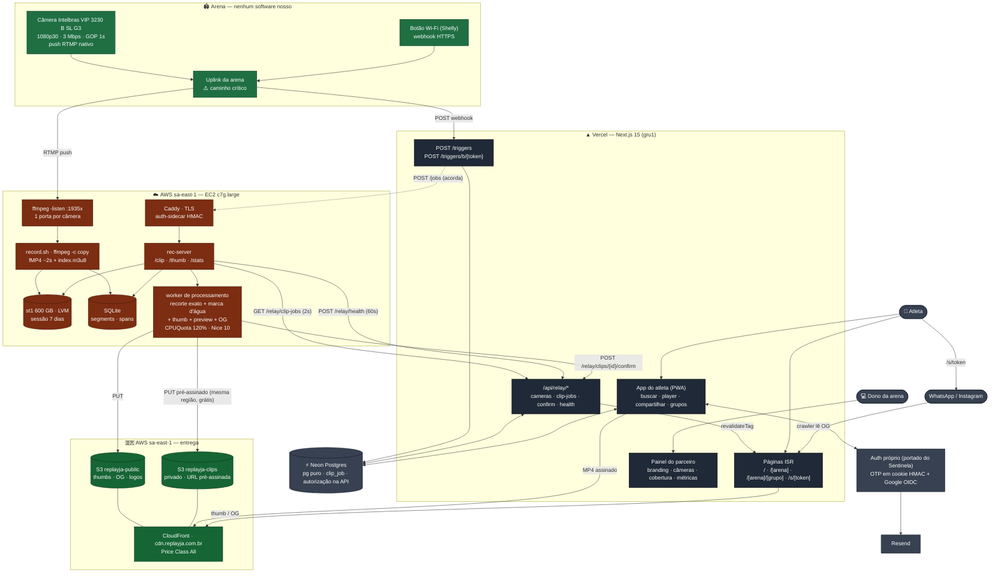
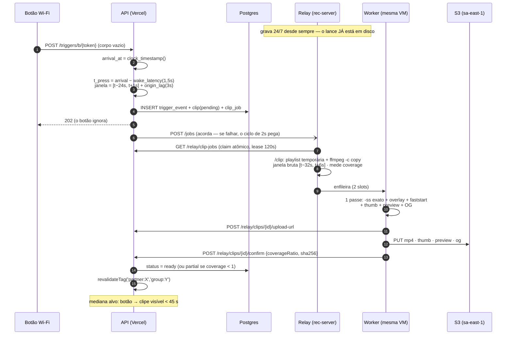

# ADR 0001 — Stack e arquitetura do Replay já 2.0

- **Status**: Proposto (aguardando aprovação em `PLANO.md` 0.9)
- **Data**: 2026-09-12 · **Revisão 3** no mesmo dia (rev. 2: relay em vez de borda; rev. 3: reaproveitar contas e padrões do Sentinela)
- **Contexto de decisão**: Fase 0, task 0.3 do `PLANO.md`
- **Relacionados**: `docs/PRD.md`, `docs/concorrentes.md`, `docs/modelo-de-dados.md`, `docs/api/openapi.yaml`, `docs/api/README.md`, `docs/plano-tecnico.md`, `docs/hardware/*`
- **Código de referência (produção, só leitura)**: `C:\Users\gabri\Documents\monitoring\relay2\` — relay v2 do Sentinela, no ar desde 29/08/2026

> **Revisão 2 — o que mudou.** A revisão 1 assumia um **computador de borda** por arena
> (mini PC x86 com FFmpeg) fazendo buffer, corte e marca d'água. A premissa mudou: a câmera IP
> **empurra RTMP** direto para um relay nosso na AWS, que grava 24/7 e corta o clipe a partir do
> índice — exatamente o que o relay v2 do Sentinela já faz em produção. Isso elimina PC, NVMe,
> OTA e agente de borda, e entrega a gravação da sessão completa de graça.
> O computador de borda vira **plano B** (§9).

---

## 1. Contexto e forças

| Força | Implicação |
|---|---|
| **8 semanas até o primeiro contrato piloto** | Nada de infra para operar além do estritamente necessário. Um workstream inteiro (agente de borda, imagem de disco, OTA, provisionamento em campo) desaparece com o relay |
| **2–3 devs full-stack, fortes em TypeScript** | Uma linguagem só. O relay é a exceção deliberada: é Python + shell **que já existe e já funciona** |
| **Pitch: "produto superior a custo igual ou menor"** | O custo por arena vai para a proposta comercial. Precisa ser baixo, previsível e **sem CAPEX por quadra** |
| **Compartilhamento é o produto** | O clipe vai para o WhatsApp e para o Instagram. Egress desproporcional ao armazenamento |
| **Sessão completa gravada** | Com o relay, ela é o **subproduto natural** da arquitetura, não uma feature a construir |
| **Uplink residencial da arena, agora no caminho crítico** | Sem buffer local, uma queda de internet é um lance perdido. É o risco nº 1 desta revisão (§8) |
| **Já temos um relay em produção** | `relay2/` grava 24 câmeras, serve `/clip` e `/thumb`, e carrega meses de lições aprendidas em incidente real. Forkar é mais rápido e mais seguro que escrever |

### Volumetria de referência (derivada em `modelo-de-dados.md` §8)

Câmeras 1080p30 a **3 Mbps**, push 24/7, retenção em disco limitada à janela de operação de 12 h/dia, clipe entregue de 25 s a 4 Mbps.

| | Piloto (1 arena, 4 quadras) | 20 arenas (80 câmeras) |
|---|---|---|
| **Ingresso no relay (24/7)** | **3,89 TB/mês** | 77,8 TB/mês |
| Sessão residente em disco | 454 GB (7 dias) | 3,89 TB (3 dias) |
| Clipes/dia | 200 (~12,5 MB) | 4.000 |
| Upload do relay para o armazenamento | 78 GB/mês | 1,56 TB/mês |
| Clipes residentes (retenção de **90 dias**) | **~235 GB** | ~4,7 TB |
| **Egress para atletas** (5 views/clipe) | 375 GB/mês | 7,5 TB/mês |

> Duas assimetrias governam todo o custo: **o ingresso é 50× o upload de clipes**, e **o egress para atletas é 5× o upload de clipes**. Quem paga ingresso perde; quem paga egress perde mais.

### Premissas de preço

Preços de lista, em USD, consultados em **11–12/09/2026** nas páginas oficiais e na **AWS Price List Bulk API** (`publicationDate` 2026-09-10/11). Conversão a **USD 1 = R$ 5,10** (PTAX 11/09/2026: R$ 5,0918; spot 12/09: R$ 5,1052). São **estimativas**; a conta real varia com uso e câmbio.

---

## 2. Decisão 1 — Onde a captura acontece

| | **A. Relay próprio (fork do relay v2)** | **B. Computador de borda na arena** | **C. Ingest gerenciado (IVS / MediaLive / CF Stream Live)** |
|---|---|---|---|
| Hardware por arena | Câmera + botão Wi-Fi | Câmera + botão + **mini PC + NVMe** | Câmera + botão |
| CAPEX por arena | ~R$ 0 | **R$ 2.800–3.500** (mini PC N100 R$ 2.336–2.998 no varejo BR + NVMe) | ~R$ 0 |
| Software nosso na arena | **nenhum** | agente + imagem de disco + OTA + watchdog | nenhum |
| Sessão completa | subproduto natural | precisa ser construída | cobrada por minuto |
| Sobrevive a queda de internet | **não** (lance perdido) | **sim** (grava local, sincroniza depois) | não |
| Instalação | colar 2 campos no app da câmera | bootar imagem, parear, configurar rede | colar 2 campos |
| Suporte em campo | trocar câmera ou botão | **diagnosticar um PC remotamente** | trocar câmera |
| Esforço até o piloto | fork de código que já roda | **um workstream inteiro** | integração + custo |
| Custo/mês no piloto | **US$ 123** | US$ 0 (o hardware já foi pago) | US$ 584–4.409 |

#### Por que C está fora, com números

| Serviço | Conta para 4 câmeras 24/7 | Fonte |
|---|---|---|
| **Amazon IVS Basic** | US$ 0,20/h de ingest × 4 × 730 h = **US$ 584/mês** — e ele **não grava nem corta**; gravação e recorte continuariam sendo nossos | Price List, `AmazonIVS`, região South America |
| **AWS Elemental MediaLive** | ~US$ 1,51/h por canal HD (input 0,378 + output 1,130) × 4 × 730 h = **US$ 4.409/mês** | Price List, `AWSElementalMediaLive` sa-east-1 |
| **Cloudflare Stream (live)** | 4 × 24 h × 30 d = 175.200 min/mês armazenados × US$ 5/1.000 min = **US$ 876/mês** só de armazenamento | developers.cloudflare.com/stream/pricing |

Nenhum deles é caro por acidente: são produtos feitos para transcodificar e distribuir ao vivo para muitos espectadores. Nós precisamos do oposto — **gravar barato e ler pouquíssimo**. Um relay que faz `ffmpeg -c copy` não recodifica nada, e é por isso que cabe numa máquina de US$ 54.

### Decisão: **A — relay próprio, fork do `relay2/`**

1. **O código já existe e já sofreu.** O relay v2 está em produção desde 29/08/2026 com 24 câmeras. O fork herda coisas que levariam semanas para descobrir sozinho: a regra de ouro do gravador (uma sessão da origem = um ffmpeg = um diretório, porque emendar sessões faz o muxer parar de cortar arquivos **em silêncio**), o `db_release()` por requisição (sem ele um cursor aberto trava o checkpoint do SQLite e o WAL vai a 7,1 GB sem um único erro em lugar nenhum), o `VACUUM INTO` no backup (o `.backup` nunca termina com WAL grande — queimou 7h28min para entregar 4 KB), e o `#EXT-X-START` na playlist ao vivo.
2. **Elimina o maior risco de cronograma.** O workstream "agente de borda + imagem + OTA + provisionamento" era o caminho crítico das 8 semanas. Ele deixa de existir.
3. **A gravação da sessão completa — objetivo 3 do PRD — sai de graça**, porque é literalmente o que o relay faz o tempo todo. No desenho de borda ela era uma feature a construir e um problema de upload a resolver.
4. **Zero CAPEX por arena** muda a conversa comercial: dá para oferecer comodato sem imobilizar R$ 3.000 por arena antes do primeiro real de receita.

**O que se perde, e é caro**: a autonomia local. Sem buffer na arena, uma queda de uplink é um lance perdido para sempre. Esse é agora o risco nº 1 do projeto e tem tratamento próprio em §8 e em `plano-tecnico.md`.

### Sub-decisão: `ffmpeg -listen` por porta vs ingest único

| | **`ffmpeg -listen`, uma porta por câmera** | **MediaMTX (só RTMP) / SRS / nginx-rtmp, porta única** |
|---|---|---|
| Em produção hoje | **sim**, é o que o relay v2 faz | não |
| Isolamento de falha | um gravador morre, uma câmera para | o ingest morre, **todas** param |
| Firewall | faixa de portas aberta à mão (19350–19449) | uma porta |
| Escala | `ffmpeg -listen` atende **uma** conexão por porta | centenas |
| Componente novo | nenhum | um daemon a operar |

**Decisão: `ffmpeg -listen` até 24 câmeras por relay; acima disso, MediaMTX em modo RTMP-only.**

O limiar de 24 vem de duas coisas: a faixa de portas vira incômodo operacional (a instalação do Sentinela teve o incidente de só a porta 19350 estar aberta — 19351 e 1935 respondiam com pacote descartado, e o sintoma de fora é um *timeout* de 8 s que não diz nada), e o isolamento por processo deixa de compensar quando o número de unidades systemd fica grande.

A objeção óbvia é que **o relay v1 usava MediaMTX e panicava ~20×/dia** (nil pointer no muxer HLS sob troca de sessão, sem correção upstream). A distinção importa: o que quebrava era o **muxer HLS**, não o ingest RTMP. Na configuração proposta o MediaMTX só recebe RTMP e o `ffmpeg` continua gravando (puxando de `rtmp://127.0.0.1/...`) — o componente que falhou fica desligado. Se ainda assim der problema, SRS e nginx-rtmp são substitutos diretos.

**Regra operacional inegociável**: o relay do Replay já roda em **máquina separada** da do Sentinela. Aquela é produção com clientes pagantes, já mediu **53% de CPU steal** e não tem folga para absorver carga nova.

---

## 3. Decisão 2 — Qual máquina (e por que não é Lightsail)

Esta seção contraria a premissa recebida, e o motivo é um número.

### A armadilha: no Lightsail, **entrada de dados consome a franquia**

Documentação oficial da AWS, citada literalmente:

> "Both data transfer IN and data transfer OUT of your instance count toward your data transfer allowance."

> "Plans in the Mumbai, Sydney, Jakarta, Malaysia, Hong Kong and **São Paulo** Regions include **half the data transfer allowances** of other Regions."

Nosso ingresso é de **3,89 TB/mês por arena** — 50× maior que tudo que sai. Um relay é a carga mais desfavorável possível ao modelo de preço do Lightsail, que foi desenhado para servidores web (muito OUT, pouco IN).

### Comparação para o piloto (4 câmeras, 3,89 TB/mês de ingresso, 600 GB de disco)

| | **Lightsail US$ 84** (4 vCPU / 16 GB / 320 GB) | **EC2 `c7g.large`** (2 vCPU Graviton, dedicada) |
|---|---|---|
| Instância | US$ 84,00 | **US$ 53,66** (Savings Plan 1 ano, No-Upfront; on-demand US$ 81,10) |
| Franquia de transferência | 3 TB na tabela, **1,5 TB em São Paulo** pela doc | não se aplica |
| **Entrada (3,89 TB)** | **conta contra a franquia** | **US$ 0,00** — a AWS nunca cobra ingresso |
| Saída (78 GB de clipes) | conta | primeiros 100 GB/mês grátis na conta → ~US$ 0 |
| **Excedente** | (3,97 − 1,5) TB × US$ 0,15 = **US$ 370,50** | — |
| Disco | bloco 600 GB × US$ 0,10 = US$ 60,00 | gp3 60 GB (US$ 9,12) + st1 600 GB (US$ 51,60) = **US$ 60,72** |
| IPv4 público | incluso | US$ 3,65 |
| Margem de saída | — | US$ 5,00 |
| **Total** | **US$ 514,50/mês → R$ 2.624** | **US$ 123,03/mês → R$ 627** |

**Quatro vezes mais barato, e a diferença inteira é uma linha de letra miúda sobre tráfego de entrada.**

### Decisão: **EC2 `c7g.large` em `sa-east-1`, Savings Plan de 1 ano**

- **Graviton (arm64)**: `ffmpeg` e Python rodam nativamente; 34% mais barato que `c6i.large` pelo mesmo trabalho.
- **Família `c7g`, não `t4g`**: a T é *burstable*, e a lição do Sentinela é direta — passou do baseline, o hipervisor estrangula, e a máquina ficou com ~1,9 de 4 vCPU sem nenhum aviso. Um gravador estrangulado perde segmento, e segmento perdido é lance perdido. **CPU dedicada não é luxo aqui, é requisito funcional.**
- **Disco em dois volumes**: `gp3` de 60 GB para SO e índice SQLite (precisa de IOPS), `st1` de 600 GB para a mídia (US$ 0,086/GB-mês contra US$ 0,152 do gp3 — 43% mais barato, e gravação de vídeo é exatamente a carga sequencial para a qual o st1 existe). A 600 GB o st1 entrega 24 MB/s de baseline; nosso fluxo de escrita é de 1,5 MB/s.
- **LVM sobre o volume de mídia**, como no Sentinela: crescer o disco vira `pvcreate` + `vgextend` + `lvextend -r` sem parar nenhum gravador.
- **Elastic IP** para o `rtmp_host`: se a instância morrer, o IP muda de máquina e as câmeras reconectam sozinhas, sem ninguém ir à quadra redigitar nada.

> **Achado a verificar na fatura do Sentinela.** Se a regra de "entrada conta" está sendo aplicada, o relay do Sentinela — que passou a ~240 GB/dia de ingresso com as Intelbras em 1080p, ou **7,2 TB/mês** — está estourando uma franquia de 1,5–3 TB e acumulando **US$ 630–855/mês** de excedente a US$ 0,15/GB. Pode ser que a franquia cheia esteja valendo (o metadado do price list de `sa-east-1` mostra os valores cheios, contradizendo a doc), mas a diferença entre as duas hipóteses é grande demais para ficar sem conferência. **É uma checagem de 5 minutos no Cost Explorer e não depende deste projeto.**

---

## 4. Decisão 3 — Front-end, banco e autenticação: reaproveitar a conta e o padrão do Sentinela

> **Revisão 3.** As revisões 1 e 2 dimensionavam Vercel, Supabase e Sentry como contratações novas. Não são: a Vercel e o Neon **já estão pagos** para o Sentinela, o padrão de autenticação dele **já está em produção**, e o Sentry sai. O que se decide aqui é o **custo marginal** e o que se copia.

### 4.1 Front-end — Next.js na Vercel (conta existente)

Mantida a decisão das revisões anteriores (ISR + `generateMetadata()` + previews por PR), agora com custo marginal quase nulo: **o Replay já entra como projeto novo no time que já existe**.

| Item | Custo marginal |
|---|---|
| Projeto novo no mesmo time Pro | **US$ 0** |
| Seats | **US$ 0** se os devs já têm seat; **US$ 20/mês** por seat novo com permissão de deploy (`Viewer` é grátis e ilimitado) |
| Fast Data Transfer / Edge Requests | Somam ao pacote do time (1 TB + 10M inclusos). O tráfego do piloto — HTML, JS e nenhum byte de vídeo — é ruído dentro disso |

**Atenção ao efeito colateral**: o uso do Replay já passa a contar **na fatura do Sentinela**. Mitigação barata e que vale desde o dia 1: criar o projeto com **Spend Management** e um alerta de gasto no time, para que um bug de cache no produto novo não apareça como surpresa na conta do produto antigo.

Decisões de contenção mantidas: região **`gru1`** para os handlers que falam com o banco, e **Image Optimization desligada** para mídia (em `gru1` custa US$ 0,0812/1K transformações e US$ 6,40/1M cache writes, e o thumbnail já sai pronto do relay).

### 4.2 Banco — Neon (conta existente), não Supabase

O Sentinela já roda em Neon com `pg` puro (`lib/db.ts`). O Replay já entra como **projeto novo na mesma conta** — projeto, não branch: branch compartilha o histórico e as regras de um banco que é de outro produto, e a separação por projeto dá isolamento de conexão, de backup e de restauração.

> **Região: `aws-sa-east-1` (São Paulo). Decidido, e é irreversível na prática.** A região existe e está disponível — `AWS South America (São Paulo) — aws-sa-east-1` consta da lista oficial ([Neon — AWS and Azure Regions](https://neon.com/docs/introduction/regions), consultado em 12/09/2026). O Neon não permite mudar a região de um projeto depois de criado — migrar exige `pg_dump`/`restore` para um projeto novo e uma janela de indisponibilidade. Essa decisão fecha a pendência marcada como bloqueante em `docs/legal/analise-lgpd.md` §11.1: com o banco em São Paulo, `app_user`, grupos, convites e `app_error` ficam **em repouso no Brasil**, e o produto deixa de ter o banco inteiro como transferência internacional estrutural. A ressalva de §6.1 vale aqui também — dado em repouso no Brasil operado por empresa estrangeira ainda pode configurar transferência se houver acesso do exterior.

| Item | Piloto | Observação |
|---|---|---|
| Storage | **~US$ 0,35/mês** | US$ 0,35/GB-mês; o banco fica abaixo de 1 GB/ano (sem `session_segment` espelhado) |
| Compute | **US$ 10–19/mês** | US$ 0,106/CU-hora no Launch. Ver o parágrafo abaixo — é aqui que mora o custo inteiro |
| **Total marginal** | **≈ US$ 10–19/mês** | Pode ser absorvido pela franquia do plano atual; conferir no console |

> **O que mantém o Neon acordado é o nosso próprio polling.** O Neon suspende o compute depois de alguns minutos ocioso, e é assim que a conta fica barata. Mas o relay consulta `GET /relay/clip-jobs`, e se ele perguntar a cada 2 segundos **o banco nunca dorme** — 730 CU-horas/mês, US$ 19,35 mesmo com o produto parado de madrugada.
>
> **Decisão: polling adaptativo.** 2 s dentro do horário de operação da quadra, 60 s fora dele, combinado com o `POST /jobs` que já acorda o relay na hora do gatilho. A latência percebida não muda (quem manda o aviso é a API), e o compute cai para ~12 h/dia → **≈ US$ 10/mês**. O horário de operação já existe no modelo de dados (`court.opens_time`/`closes_time`), então isso é configuração, não código novo.

### 4.3 Acesso ao banco — `pg` puro, não Drizzle

| | **A. `pg` puro + migrações em SQL versionado** | B. Drizzle ORM + `drizzle-kit` |
|---|---|---|
| O time já opera assim | **sim** (`lib/db.ts` do Sentinela) | não |
| Tipos do resultado | declarados por consulta (`query<ClipRow>(...)`) | inferidos do schema |
| Migrações | arquivos `.sql` numerados + runner de ~40 linhas + `schema_migrations` | geradas a partir do schema TS |
| Passo de codegen no CI | nenhum | sim, e um schema TS que precisa ficar em sincronia |
| As três consultas que dão valor ao produto | SQL, exatamente como estão documentadas | SQL cru dentro do Drizzle, exatamente igual |

**Decisão: `pg` puro.** As três consultas que sustentam o produto — a busca por keyset (§6.1 do modelo de dados), a CTE de sessões semanais com `AT TIME ZONE` (§6.2) e a reivindicação de job com `FOR UPDATE SKIP LOCKED` (§3.12) — seriam escritas como SQL cru em qualquer ORM. O que sobraria do Drizzle é um schema em TypeScript para manter em sincronia e um passo de geração no CI, em troca de tipagem que a declaração por consulta já resolve. Com três devs que já conhecem o padrão do outro produto, **um modelo mental só entre os dois repositórios vale mais que inferência de tipos**.

O que se perde e como se compensa:

- **Tipos não verificados contra o banco** → teste de CI que aplica todas as migrações num **branch efêmero do Neon** e roda um arquivo de `SELECT` de fumaça contra cada consulta nomeada. Pega coluna renomeada, que é o erro real.
- **Migrações sem rollback automático** → toda migração tem um `-- down` no mesmo arquivo, e o CI aplica `up`, `down`, `up` no branch efêmero.
- Copiar de `lib/db.ts`: o pool preguiçoso no `globalThis` (o hot-reload vaza conexões sem ele), `max: 3` (serverless abre um pool por instância), o handler de `'error'` no pool (o Neon derruba conexão ociosa e sem handler isso **derruba o processo**), e o par `query`/`tryQuery` — leitura essencial lança, escrita de auditoria engole.

### 4.4 Autenticação — portar o padrão do Sentinela, e acrescentar o Google

**Decisão: portar `lib/otp.ts`, `lib/session.ts`, `lib/app-secret.ts`, `lib/rate-limit.ts` e o `app/api/login/route.ts`**, adaptando; e implementar o Google com **fluxo OIDC manual**, não com Auth.js.

#### O que se copia sem discussão

| Peça | Por que ela é boa |
|---|---|
| **OTP de 6 dígitos com o desafio num cookie HMAC de 10 min** (`otp.ts`) | **Sem tabela.** O desafio é `{email, HMAC(email:code), exp}` assinado — não há linha para expirar, limpar nem vazar. Para um produto cujo diferencial é login sem fricção, é o mínimo de infraestrutura possível |
| **`app-secret.ts`** | Um segredo, um lugar, e **lança em produção quando `SESSION_SECRET` falta** em vez de cair num fallback que está no código-fonte. O comentário do arquivo explica por que isso não é paranoia: um deploy sem a variável continuaria funcionando "lindamente", assinando tudo com uma string pública |
| **`safeEqualB64`** comparando **buffers**, não strings | Uma assinatura com o mesmo número de caracteres mas com um multibyte faz `timingSafeEqual` lançar `RangeError` — que, solto, vira 500 em toda requisição enquanto o cookie existir |
| **Sessão em cookie HMAC de 400 dias com renovação deslizante** (`session.ts`) | Sem tabela de sessões. 400 dias é o teto que os navegadores aceitam, e o `needsRenewal` reemite depois de 7 dias |
| **`secure: NODE_ENV === 'production'`** nos dois cookies | O Next **não** marca `Secure` sozinho; sem isso o desafio do OTP e a sessão trafegam em HTTP claro |
| **`rate-limit.ts` com contador no Postgres e fallback em memória** | A Vercel roda N instâncias: um `Map` só limitaria a instância que atendeu. E o fallback vale menos, mas é muito melhor que liberar tudo quando o banco cai |
| **A ordem dos tetos no `login/route.ts`** | Todos os limites vêm **antes** de qualquer consulta cara. No Sentinela, enquanto os baldes do passo 2 ficavam depois do `resolveAccess`, bastava mandar um `code` qualquer para pular os baldes do passo 1 |
| **`peek` no balde do e-mail no passo 2** | Só o **erro** custa ficha: quem digita certo de primeira não pode ficar mais perto do bloqueio por ter feito login |
| **`Retry-After` junto da mensagem** | É o que faz o navegador parar de martelar sozinho |

#### O que muda em relação ao Sentinela

| | Sentinela | Replay já |
|---|---|---|
| Existe tabela de usuário? | **Não** — o e-mail no cookie basta | **Sim.** Grupos, convites e posse exigem `app_user.id`. O `verify` faz `INSERT ... ON CONFLICT (email) DO UPDATE ... RETURNING id` e o cookie carrega `uid` |
| Autorização no cookie | `plan`, `rec`, `chk`, `dsig` — foto do billing do Stripe | **Nada disso.** Não há billing no caminho do atleta. O cookie carrega `{uid, email, exp}` e só |
| Papel de admin da arena | — | **Consultado no banco** quando a rota é `/app/parceiro/*`, nunca guardado no cookie. É uma consulta indexada por requisição de painel, e evita a classe inteira de bug "cookie diz que sou admin de uma arena que já me removeu" |
| Provedores | só OTP | OTP **+ Google** |

#### Google: fluxo OIDC manual, não Auth.js

| | **A. OIDC manual (~150 linhas)** | B. Auth.js / NextAuth só para o Google |
|---|---|---|
| Quem é dono da sessão | **nós**, o mesmo cookie do OTP | o Auth.js, com cookie e ciclo próprios |
| Resultado | um sistema de sessão | **dois** sistemas de sessão no mesmo app, ou uma ponte entre eles |
| Dependência | `jose` (verificação de JWKS) | Auth.js + adapter, com majors que quebram |
| Regra de vinculação de conta | escrita por nós de qualquer jeito | escrita por nós de qualquer jeito, dentro de um callback |
| Superfície a auditar | um arquivo que lemos inteiro | um framework de autenticação |

**Decisão: A.** O argumento decisivo não é tamanho, é **posse da sessão**. Adotar o Auth.js só para o Google criaria dois donos de sessão num app cuja autenticação, fora isso, não tem dependência nenhuma — e a alternativa (adotar Auth.js para tudo) jogaria fora um fluxo de OTP que já está em produção e já sobreviveu a auditoria. Para **um** provedor, sem necessidade de refresh token (nunca chamamos API do Google de novo), o OIDC é um `redirect`, um `POST` de troca e uma verificação de assinatura.

Esqueleto, no estilo do `otp.ts`:

```
GET  /api/auth/google           → gera state + nonce + PKCE, guarda num cookie HMAC de 10 min
                                  (mesmo encodeChallenge), redireciona com prompt=select_account
GET  /api/auth/google/callback  → confere state, troca o code em oauth2.googleapis.com/token,
                                  verifica o id_token com o JWKS do Google (jose),
                                  exige iss/aud/nonce/exp,
                                  → upsert de app_user por e-mail → mesmo sessionCookie do OTP
```

**As três checagens que não podem faltar** — errar qualquer uma delas é tomada de conta alheia:

1. **`email_verified === true`.** Sem isso, alguém cria uma conta Google com o e-mail de outra pessoa e entra como ela.
2. **`aud === GOOGLE_CLIENT_ID`** e **`iss ∈ {accounts.google.com, https://accounts.google.com}`**. Um `id_token` legítimo emitido para *outro* aplicativo é assinado pelo Google e passa na verificação de assinatura.
3. **`nonce`** conferido contra o cookie do desafio, contra replay.

**Vinculação de contas**: a chave é o **e-mail verificado**. Quem entrou por OTP na segunda e por Google na quarta cai na mesma `app_user`, porque o `upsert` é por e-mail e os dois caminhos só chegam lá com o e-mail comprovado. Isso é o diferencial identificado em `concorrentes.md` — nenhum concorrente tem login social.

#### Resend — mesma conta, domínio novo

**Decisão: reaproveitar a conta, verificar o domínio `replayja.com.br`** (envio por `mail.replayja.com.br`, com SPF, DKIM e DMARC próprios).

Um OTP do "Replay já" chegando de `@sentinelacam.com` parece phishing, e o atleta que não reconhece o remetente não confirma o código — o que mata exatamente a métrica que o produto precisa proteger. Reputação de envio é por domínio, então separá-los também impede que um problema num produto queime a entregabilidade do outro. A conta é a mesma porque a Resend verifica vários domínios por conta e não há motivo para uma segunda fatura.

> **O teto do plano gratuito é compartilhado, e é por dia.** Free = 3.000 e-mails/mês **e 100/dia**, somando os dois produtos. O piloto sozinho deve ficar em 60–80/dia (logins, convites de grupo, resumo semanal), então **o limite diário é o que vai estourar primeiro, não o mensal**. No perfil "enxuto" isso é assumido conscientemente; no "confortável", Resend Pro (US$ 20/mês, 50 mil) cobre os dois produtos com uma assinatura só.

### 4.5 O que sai: Supabase, Sentry e RLS

- **Supabase** sai inteiro: banco (→ Neon), Auth (→ padrão portado), Storage (nunca foi usado — a mídia é S3), Realtime (→ o painel faz polling de 30 s, que para 4 câmeras é irrelevante) e `pg_cron` (→ **Vercel Cron**, que já vem no plano).
- **Sentry** sai. Ver §7.
- **RLS** sai junto com o Supabase, e essa é a perda que mais pesa: era uma segunda camada de autorização, no banco, que barrava um bug da API. **Agora existe uma camada só.** O tratamento está em `docs/api/README.md` §3 e em `modelo-de-dados.md` §7 — e é uma dívida de segurança assumida, não um detalhe.

## 5. Decisão 4 — Onde a marca d'água é aplicada

**O conflito com `docs/hardware/` resolveu-se sozinho.** Sem computador de borda, não há onde aplicar na arena: a marca d'água vai para a nuvem, como o doc de hardware já defendia. O que resta decidir é **em qual máquina da nuvem**.

| | **A. No próprio relay, worker separado** | B. Worker serverless (Vercel / Cloudflare Containers) | C. Instância dedicada de processamento |
|---|---|---|---|
| Os bytes já estão ali? | **sim** | não — 19 MB descem e 12,5 MB sobem por clipe | não |
| Transferência por clipe | **0** | 200 clipes/dia × 31,5 MB = 189 GB/mês × US$ 0,25 (saída AWS SP) = **US$ 47/mês**, mais o custo do lado de lá | idem |
| Infra nova | um processo e um cgroup | um produto novo (preço do CF Containers **não confirmado**) | uma instância |
| Contenção com os gravadores | **sim, é o risco** | nenhuma | nenhuma |

### Decisão: **A — worker de processamento na própria VM do relay**, com contenção explícita

O passe roda **uma vez** e faz tudo junto — recorte exato, overlay, thumbnail, preview, OG e `faststart`:

```bash
# entrada: recorte bruto de ~38 s produzido por /clip com -c copy
ffmpeg -hide_banner -ss "$OFFSET" -t 25 -i raw.mp4 -i watermark.png \
  -filter_complex "[1:v]scale=iw*${SCALE}:-1[wm];\
                   [0:v][wm]overlay=W-w-${MX}:H-h-${MY}:format=auto,format=yuv420p" \
  -c:v libx264 -preset veryfast -b:v 4M -maxrate 4.5M -bufsize 8M \
  -movflags +faststart -an -y clip-wm.mp4
```

- `-ss` **depois** do `-i` (seek de saída): decodifica desde o começo do recorte e para no quadro certo. Ao contrário do seek de entrada, não erra o alvo quando o keyframe está antes. É a mesma receita do `/thumb` do relay v2.
- `format=yuv420p` explícito. Sem isso o vídeo **não toca no iOS**.
- Bitrate de saída de 4 Mbps sobre uma fonte de 3 Mbps: dá folga para o overlay sem inventar qualidade que a fonte não tem.

**Dimensionamento, a partir de medição real.** O Sentinela mediu 1080p → 1080p `veryfast crf 28` a **0,7–1,4 núcleo por câmera em tempo contínuo**. Nosso passe processa 38 s de fonte por clipe: **27–53 núcleo-segundos por clipe**. A 200 clipes/dia isso é 1,5–3 núcleo-hora/dia, ou **6–12% de um núcleo na média**. O problema não é a média, é o pico — quatro botões apertados no mesmo minuto.

Contenção, copiada do que já funciona no relay v2:
- **2 slots** de processamento (`CLIP_SLOTS`), fila além disso, `503` + `Retry-After` se saturar.
- Unidade systemd separada com `CPUQuota=120%` e `Nice=10`: **os gravadores têm prioridade absoluta**. É melhor um clipe sair 40 s depois do que um segmento de sessão se perder.
- `timeout` no ffmpeg (120 s) — matar o processo travado em vez de segurar a fila.

**Escape documentado**: se a medição da semana 1 mostrar contenção, o worker vira uma instância própria e o contrato de API **não muda** — `POST /relay/clips/{id}/upload-url` e `/confirm` já são chamados por "quem processou", não por "o gravador".

**Ganho novo que o desenho de borda não tinha**: como a marca é aplicada na nuvem e o recorte bruto fica 48 h em disco, **trocar o logo da arena permite reprocessar os clipes recentes**. `clip.watermark_version` diz quais estão desatualizados.

---

## 6. Decisão 5 — Armazenamento e entrega dos clipes, com o dado em repouso no Brasil

> **Revisão 3.1.** As revisões anteriores escolheram o Cloudflare R2 pelo egress zero. O fundador decidiu **tentar manter o dado em repouso no Brasil**, e o R2 **não tem região na América do Sul** — as *location hints* são apenas `wnam`, `enam`, `weur`, `eeur`, `apac` e `oc`, e as restrições jurisdicionais apenas `eu`, `us` e `fedramp`. Esta seção refaz a escolha sob essa restrição.

### 6.1 O que "só Brasil" significa, e o que ele não resolve

Três coisas diferentes costumam ser confundidas numa frase só, e a diferença muda a decisão:

| | O que é | Quem entrega |
|---|---|---|
| **Repouso no Brasil** | O objeto persistido fica num data center em território nacional | S3 `sa-east-1`, OCI São Paulo, Magalu, disco do relay |
| **Todas as cópias no Brasil** | Nem o cache temporário sai do país | Só sem CDN global, ou com CDN exclusivamente brasileira |
| **Operador brasileiro** | Empresa sujeita apenas à jurisdição brasileira | Só a Magalu, entre as opções |

**Uma CDN global cria cópias fora do Brasil, por definição** — é o trabalho dela. Escolher S3 `sa-east-1` coloca o objeto de origem no Brasil, mas cada clipe assistido deixa uma cópia no PoP que atendeu.

> **Ressalva honesta, e ela precisa chegar ao fundador antes da decisão final:** dado em repouso no Brasil, **operado por empresa estrangeira**, ainda pode configurar **transferência internacional** sob a LGPD (arts. 33 a 36) e o Regulamento aprovado pela **Resolução CD/ANPD nº 19/2024** — basta haver acesso a partir do exterior, o que inclui suporte, administração e resposta a incidente. "Só Brasil" **reduz a exposição, não elimina a análise**, e não dispensa cláusulas-padrão contratuais com AWS, Oracle ou Bunny.
>
> **E há um contra-argumento que desafia a intuição.** `docs/legal/analise-lgpd.md` §11.2 recomendava o R2 com jurisdição **`eu`**, porque a União Europeia **tem decisão de adequação da ANPD** (Resolução CD/ANPD nº 32/2026) e os Estados Unidos não. Pelo critério estritamente jurídico, **vídeo na UE pode ser um caminho mais limpo do que vídeo em São Paulo operado por uma empresa dos EUA sem CPC assinada**: o primeiro tem mecanismo de adequação pronto, o segundo depende de contrato. "Tentar só Brasil" é defensável por outros motivos — percepção do cliente e do parceiro, soberania, latência de origem, uma perna internacional a menos para documentar — mas **não é automaticamente a opção de menor risco regulatório**, e o fundador deve decidir sabendo disso.
>
> Isto é **insumo para o agente de LGPD, não conclusão jurídica minha**. Esta ADR decide a arquitetura; a qualificação de cada perna e a escolha do mecanismo ficam em `docs/legal/analise-lgpd.md` §11.

### 6.2 A opção que foi eliminada por contrato, não por preço

**Servir do relay com o CDN da Cloudflare como cache na frente está fora.** Os termos de serviço da Cloudflare, na seção *Content Delivery Network (Free, Pro, or Business)*, dizem literalmente:

> "Cloudflare reserves the right to disable or limit your access to or use of the CDN […] if you use or are suspected of using the CDN without such Paid Services to serve video or a disproportionate percentage of pictures, audio files, or other large files."
>
> "Cloudflare offers specific Paid Services (e.g., the Developer Platform, Images, and Stream) that you must use in order to serve video and other large files via the CDN."

*(cloudflare.com/service-specific-terms-application-services, consultado em 12/09/2026)*

Usar o CDN da Cloudflare em plano Pro para cachear MP4 de uma origem na AWS é exatamente o caso vedado. O caminho suportado seria Stream (cobrado por minuto — descartado em §2) ou Enterprise.

> Efeito colateral útil: o desenho das revisões 1 e 2 (**R2 + domínio customizado**) **é** o caminho suportado, porque o R2 faz parte do "Developer Platform" citado como o produto exigido. E os **thumbnails** continuam sem problema em qualquer CDN — a cláusula ataca vídeo e "percentual desproporcional" de arquivos grandes, não JPEG de 40 KB.

### 6.3 As opções, com números

Volumes com retenção de clipe de **90 dias**: piloto 77 GB/mês de upload, **230 GB residentes**, 366 GB/mês de egress; 6 arenas 461 / 1.382 / 2.197 GB; 20 arenas 1.535 / 4.606 / 7.324 GB.

**O fato estrutural que decide quase tudo**: o clipe nasce no relay, dentro da AWS em São Paulo, onde a saída para a internet custa **US$ 0,25/GB**. Mandar o clipe para qualquer lugar **fora** da AWS custa US$ 0 no piloto (franquia de 100 GB/mês), mas **US$ 90/mês a 6 arenas e US$ 359/mês a 20**. Só o S3 na mesma região escapa disso, porque `EC2 → S3 sa-east-1` é gratuito.

Convenção de confiança: **[F]** fonte oficial lida · **[S]** snippet de busca · **[E]** estimativa · **[NC]** não confirmado.

| Opção | Repouso | Operador | Armazenamento | Entrega | **Piloto** | **6 arenas** | **20 arenas** |
|---|---|---|---|---|---:|---:|---:|
| **S3 `sa-east-1` + CloudFront** *pay-as-you-go*, Price Class All | 🇧🇷 SP | EUA | US$ 0,0405/GB [F] | SA US$ 0,110/GB, **1 TB/mês grátis** [F] | **US$ 9,53** | **185,22** | **879,75** |
| S3 + CloudFront *pay-as-you-go*, Price Class 100 | 🇧🇷 SP | EUA | idem | US$ 0,085/GB, servido dos EUA [F] | 9,53 | 155,88 | 722,24 |
| S3 + CloudFront **plano flat Pro** | 🇧🇷 SP | EUA | idem | US$ 15/mês, **50 TB inclusos, sem excedente** [NC] | 24,53 | **71,16** | **201,72** |
| **OCI Object Storage São Paulo** | 🇧🇷 SP | EUA | US$ 0,0255/GB [F] | **10 TB/mês grátis** [F]; depois **US$ 0,025/GB** na América do Sul [F] | **US$ 5,88** | **125,43** | **476,43** |
| Magalu Cloud `br-se1` | 🇧🇷 SP/Fortaleza | **🇧🇷 BR** | R$ 0,10/GiB [F] | R$ 0,10/GiB, **sem taxa de requisição** [F] | 11,68 | 160,24 | 592,48 |
| Bunny Storage SP + CDN Volume | 🇧🇷 SP [F] | Eslovênia | US$ 0,01/GB [F] | US$ 0,005/GB, **SP está no tier Volume** [F] | **4,13** | **114,94** | **441,46** |
| Bunny Storage SP + CDN Standard SA | 🇧🇷 SP [F] | Eslovênia | idem | US$ 0,045/GB [F] | 18,78 | 202,83 | 734,43 |
| Servir do próprio relay (disco AWS SP) | 🇧🇷 SP | EUA | já pago no `st1` | **US$ 0,25/GB** [F] | 66,55 | 524,32 | 1.806,05 |
| ~~Relay + Cloudflare CDN na frente~~ | — | — | — | **vedado por contrato** (§6.2) | — | — | — |
| *(referência)* R2, **sem** região no Brasil | 🇺🇸/🇪🇺 | EUA | US$ 0,015/GB [F] | **US$ 0** [F] | 3,45 | 110,86 | 427,87 |

Todas as linhas, exceto as do S3 e a do relay, incluem a saída da AWS para subir o clipe (US$ 0 / 90,14 / 358,79).

> **A linha marcada [NC] pode mudar a conclusão, e por isso vira tarefa da semana 1.** A AWS passou a apresentar **planos de preço fixo** de CloudFront como padrão — Free (100 GB), **Pro US$ 15/mês**, Business US$ 200, Premium US$ 1.000 —, os pagos com **50 TB inclusos e sem cobrança de excedente**; o *pay-as-you-go* virou página separada. Se valerem para o nosso caso, a entrega a 20 arenas cai de US$ 694 para US$ 15. **Não está confirmado** se há restrição de price class, de conteúdo de vídeo ou de requisições. Verificar antes de levar qualquer número para proposta comercial — é a diferença entre **R$ 603 e R$ 430 por arena** a 20 arenas.
>
> Repare na inversão: no **piloto** o *pay-as-you-go* é melhor, porque a franquia permanente de 1 TB/mês cobre os 366 GB e a entrega custa **US$ 0**; o plano flat só compensa a partir de ~2 TB/mês de entrega, ou seja, da 3ª arena.

**O prêmio de manter o vídeo no Brasil**, contra a referência do R2: **US$ 6,08/mês no piloto** (R$ 31) com S3, ou **US$ 2,43** (R$ 12) com OCI. A 20 arenas: US$ 452/mês com S3 *pay-as-you-go*, **US$ 49/mês com OCI**, e **negativo** — isto é, mais barato que o R2 — se os planos flat do CloudFront se confirmarem.

#### Leitura de cada opção

**S3 `sa-east-1` + CloudFront.** A única em que o upload do relay é gratuito, e a única que não adiciona fornecedor: mesma conta, mesma região, mesmo IAM, mesmo console de fatura. O worker do relay já faz `PUT` em URL pré-assinada S3 — **zero linha de código muda**. Durabilidade de 11 noves. A franquia permanente de 1 TB/mês de CloudFront cobre o piloto inteiro, então **a entrega custa US$ 0 até a 3ª arena**. A partir daí, a entrega é o item que cresce.

**Price Class All vs 100.** A *Price Class 100* exclui os PoPs da América do Sul: o atleta em São Paulo passa a ser servido de Miami, a US$ 0,085/GB em vez de US$ 0,110 — 23% mais barato. Mas piora o primeiro byte e o *ramp-up* de TCP num 4G de quadra, e **empurra todas as cópias de cache para fora do Brasil**, que é o oposto do objetivo. **Recomendo Price Class All**; no piloto a diferença é zero (está dentro da franquia) e a partir de 6 arenas são US$ 29/mês para manter o cache no país.

**OCI São Paulo.** A opção mais barata com dado no Brasil, e a diferença vem de uma política confirmada na tabela oficial de *Networking*: *"Outbound Data Transfer — Originating in APAC, Japan and South America — First 10 TB / Month — **Free**"*. É um SKU genérico de rede, não atrelado a compute, então vale para o Object Storage, e o preço é o mesmo em todas as regiões. Nosso egress a 20 arenas (7,3 TB) cabe na franquia com ~2,5 TB de folga. Passando dela, a América do Sul custa **US$ 0,025/GB** — três vezes o de Europa/EUA, detalhe que some para quem lê só a manchete. Tem **Amazon S3 Compatibility API** com SigV4, então o worker não muda.

Dois poréns concretos: **a OCI não tem CDN própria** com preço público (a tabela de *Edge Services* só traz Health Checks e DNS), então o atleta baixaria direto da região de São Paulo — aceitável para público 100% brasileiro, ruim no dia em que houver atleta no exterior; e **a economia depende de uma franquia**, que é exatamente o tipo de letra miúda que tornou o Lightsail inviável (§3). Antes de adotar: conferir no console a franquia real da *tenancy* e se o faturamento sai em BRL ou USD.

**Magalu Cloud.** A única em que **operador e dado são brasileiros** — regiões `br-se1` (Grande São Paulo, 3 AZs) e `br-ne1` (Fortaleza). Isso **elimina a perna do art. 33 para o dado mais sensível do produto**, e é um argumento de venda real para a arena que pergunta onde ficam os vídeos dos clientes dela. É S3-compatível com URL pré-assinada, **não cobra por requisição**, e cobra **em reais** — sem risco cambial, o que para uma receita 100% em BRL não é detalhe. Storage R$ 0,10/GiB-mês e saída R$ 0,10/GiB, confirmados na API pública de SKUs que alimenta a calculadora oficial.

Pesa contra: fornecedor pequeno e novo, e **sem CDN self-service** — a integração anunciada com a CDN da Globo Technologies (dez/2025) é comercial, sem preço público. **É a opção a promover se a exigência jurídica apertar**: um parceiro grande exigindo operador nacional em contrato, ou a ANPD endurecendo o regime de transferência.

**Bunny com storage em São Paulo.** Confirmado: **São Paulo é região de Edge Storage** e, desde 2025, **também está no tier Volume do CDN** — o que derruba a objeção das revisões anteriores, de que o preço bom dependia de roteamento *best-effort* sem PoP no Brasil. É a mais barata das opções com dado no Brasil no piloto e a 6 arenas. Pesa contra: mais um fornecedor, e "repouso em São Paulo" aqui é num data center alugado pela Bunny, sob contrato esloveno — juridicamente mais distante do objetivo do que AWS ou Magalu.

**Servir do próprio relay.** Elimina fornecedor e mantém tudo no Brasil, mas multiplica a saída da AWS por cinco **e** coloca o tráfego dos espectadores competindo com o ingest das câmeras no mesmo link — o pior acoplamento possível, já que o ingest é o que não pode falhar. Descartada por arquitetura, não por preço.

### 6.4 Decisão

> **S3 `sa-east-1` + CloudFront (Price Class All)** para o piloto e até ~6 arenas. **Plano B: OCI Object Storage São Paulo**, a avaliar antes da 6ª arena.

Cinco razões, em ordem de peso:

1. **No piloto, a decisão econômica não existe** — a diferença entre a melhor e a pior opção viável no piloto é de R$ 39/mês. O que decide é risco de execução, e o S3 é a única opção que não acrescenta fornecedor, conta, IAM nem fatura nova a um projeto de 8 semanas.
2. **Zero mudança de código.** O worker já faz `PUT` em URL pré-assinada S3-compatível; trocar o endpoint é uma variável de ambiente.
3. **Upload gratuito** por estar na mesma região do relay — a única opção que escapa dos US$ 0,25/GB de saída da AWS, o que vale US$ 90/mês já na 6ª arena.
4. **A franquia de 1 TB/mês do CloudFront cobre a entrega do piloto por inteiro.** Custo de entrega: US$ 0 até a 3ª arena.
5. **Durabilidade de 11 noves** para o único dado do produto que não pode ser recriado.

**Dois gatilhos objetivos de reavaliação, nesta ordem:**

1. **Semana 1 — confirmar os planos flat do CloudFront.** Se os US$ 15/mês com 50 TB valerem para o nosso caso, o S3 deixa de ser "a opção segura que custa um pouco mais" e passa a ser **a mais barata em qualquer escala**, e não há o que reavaliar depois. Se não valerem, o gatilho 2 vale.
2. **6ª arena, ou egress acima de 2 TB/mês — avaliar a OCI São Paulo.** É o ponto em que a diferença passa de US$ 60/mês e justifica integrar um fornecedor novo. A troca é uma camada `packages/shared/storage.ts` e um script de cópia: as duas falam S3 com SigV4, e a **Amazon S3 Compatibility API** da OCI aceita a mesma URL pré-assinada que o worker já gera.

E dois de outra natureza, que não são de engenharia:

- **Se um parceiro exigir operador nacional em contrato**, ou se o regime de transferência apertar, a resposta é a **Magalu** — a única opção em que nem o dado nem a empresa saem do Brasil, com a contrapartida de não ter CDN self-service.
- **Se "só Brasil" for relaxado**, o **R2 com jurisdição `eu`** é ao mesmo tempo **mais barato** (US$ 3,45 no piloto, US$ 428 a 20 arenas) **e** o caminho com decisão de adequação da ANPD já existente. A escolha entre "Brasil com operador dos EUA" e "UE com adequação" é de negócio e de risco jurídico — §6.1. **É a única decisão desta ADR que eu não tomo: ela é do fundador, e precisa ser tomada com a informação de §6.1 na mão.**

### 6.5 Buckets e entrega

| Bucket (S3 `sa-east-1`) | Conteúdo | Acesso |
|---|---|---|
| `replayja-clips` | MP4 com marca d'água, preview | **Privado**. URLs pré-assinadas: 6 h para reprodução, 15 min para download com `Content-Disposition: attachment` |
| `replayja-public` | Thumbnails, OG images, logos, marcas d'água | **Público** via CloudFront em `cdn.replayja.com.br`, `Cache-Control: immutable` — o crawler do WhatsApp não tem sessão |

Uma distribuição CloudFront, dois *behaviors*. Chaves: `clips/<partner>/<court>/<YYYY-MM-DD>/<clip_id>/{wm,thumb,preview,og}.<ext>`. Regra de ciclo de vida de 400 dias como rede de segurança, independente dos jobs de expurgo.

**A sessão completa continua fora disso.** Ela fica no disco do relay, com retenção de 7 dias, e não vai para armazenamento de objetos: 1,94 TB/mês de saída custariam US$ 485/mês contra US$ 39/mês para mantê-la onde já está. Como não tem nenhum leitor hoje, só os dias que a IA futura julgar valiosos serão promovidos (`session_recording.storage_location`).

---

## 7. Decisão 6 — Gatilho, fila e observabilidade

### O gatilho, e o que desapareceu com ele

Na revisão 1, o botão virtual exigia uma conexão persistente nuvem → borda (long-polling de 25 s, `LISTEN/NOTIFY`, tabela `device_command`, comandos com expiração de 15 s). **Nada disso existe mais.** O relay é uma máquina nossa, alcançável por HTTPS:

```
botão Wi-Fi  ──POST /triggers/b/<token>──┐
                                          ├──> API (Vercel) ──> clip_job no Postgres
site logado  ──POST /triggers────────────┘           │
                                                     └──POST /jobs──> relay (acorda)
                                                                        │
                              relay ──GET /relay/clip-jobs (a cada 2 s)─┘
```

**Quem manda em quem** — padrão herdado do relay v2: o app **não escreve** no relay. O relay pergunta (lista de câmeras, fila de jobs) e a resposta é sempre uma *lista*, nunca um comando. O `POST /jobs` só **acorda**; se falhar, o ciclo de 2 s pega o job. O relay continua gravando com o app inteiramente fora do ar.

E uma simplificação que vale registrar: **um job atrasado deixou de ser perigoso.** A janela é absoluta e a sessão está gravada, então executar o corte cinco minutos depois produz exatamente o mesmo clipe. Na revisão 1 o comando expirava em 15 s porque chegar tarde significava capturar o lance errado.

### O contrato do botão

O botão é um dispositivo de prateleira (Shelly Button 1 ou equivalente) com webhook configurável. O contrato é mínimo de propósito, porque o firmware é de terceiro: **segredo no caminho** da URL, **corpo vazio é válido**, `Content-Type` ignorado, resposta sempre `202`. Parâmetros opcionais (`?bat=`, `?evt=`, `?rssi=`) para os modelos que suportam template.

O segredo na URL é fraco — exatamente como a chave RTMP, e pelo mesmo motivo: o dispositivo do outro lado não sabe fazer melhor. A defesa é dano baixo (alguém dispara um clipe numa quadra pública), cooldown de 8 s, rate limit e revogação em um clique.

### Fila e jobs

**`clip_job` no próprio Postgres**, reivindicado com `FOR UPDATE SKIP LOCKED` e *lease* de 120 s (vencido volta para `pending` — é o que cobre o relay morrer no meio de um corte). Sem broker: a propriedade que importa é transacionalidade ("criar o clipe e enfileirar o corte" precisa ser atômico), e o volume do piloto é de 1 job a cada 7 minutos.

Jobs periódicos (`pg_cron` + Vercel Cron): `purge_expired_clips` (diário 04:00 BRT), `detect_camera_down` (2 min), `requeue_expired_leases` (1 min), `detect_coverage_gaps` (10 min), `rollup_session_coverage` (horário), `rollup_share_events` (diário), `reconcile_storage` (semanal), `send_group_digest`.

### Observabilidade — sem Sentry

**Decisão da revisão 3: não contratar nada.** A observabilidade do piloto é feita de coisas que já estão pagas ou são gratuitas.

| Necessidade | Como | Custo |
|---|---|---|
| Erros do app | **Runtime Logs da Vercel** + uma tabela `app_error` no Neon | US$ 0 |
| Erros e estado do relay | **`journalctl`** por unidade (`replayja-rec@<cam>`, `recserver`, `worker`) + `/stats` | US$ 0 |
| Uptime externo | **Better Stack free** em `/api/health` e `relay-1/stats` | US$ 0 |
| Saúde da captura | **Construída por nós** — `camera_health`, `relay_health`, `coverage_gap` no painel do parceiro. Isso é produto, não observabilidade | US$ 0 |
| Alerta | E-mail pela Resend (que já está no caminho) | US$ 0 |

**O que se perde, dito com todas as letras**: agregação de stack trace por release, deduplicação, *breadcrumbs* e alerta automático de pico de erro. E os Runtime Logs da Vercel têm **retenção curta** — um erro de sexta à noite pode não estar mais lá na segunda.

**O substituto concreto, que custa um dia de trabalho:**

- `logError(err, ctx)` grava em `app_error` (`fingerprint`, `message`, `stack`, `route`, `user_id`, `count`, `first_seen_at`, `last_seen_at`), com `ON CONFLICT (fingerprint) DO UPDATE SET count = count + 1`. É um Sentry pobre, mas é **consultável com SQL** e não expira.
- Um cron diário manda por e-mail as 10 `fingerprint` mais frequentes das últimas 24 h e qualquer uma **nova**.
- O `traceId` continua no corpo do erro (RFC 9457) e é o mesmo valor gravado na tabela — é o que liga a reclamação do usuário à linha.
- Alerta imediato só para a lista curta de §7 (as oito condições), por e-mail.

Quando reavaliar: ao passar de ~5 arenas, ou no primeiro incidente em que a retenção curta do log da Vercel custar mais de uma hora de investigação. Sentry Team custa US$ 26/mês no anual e a migração é um `Sentry.init` — nada nesta decisão é difícil de desfazer.

---

## 8. Decisão 7 — Domínios e roteamento

| Host | Serve | Onde |
|---|---|---|
| `replayja.com.br` | site, páginas públicas, app, painel, API, gatilhos | Vercel (Next.js, `gru1`) |
| `www.` | 308 → apex | Cloudflare |
| **`relay-1.replayja.com.br`** | `/jobs`, `/t/<token>/clip`, `/t/<token>/thumb`, `/stats` | EC2 + Caddy (TLS) |
| **`stream.replayja.com.br`** | **ingest RTMP** (`rtmp://stream.replayja.com.br:<porta>/live`) | Elastic IP do relay |
| `cdn.replayja.com.br` | thumbnails, logos, OG, e o MP4 assinado | CloudFront sobre S3 `sa-east-1` |
| `mail.replayja.com.br` | envelope/DKIM da Resend | Resend |

> `stream.` é separado de `relay-1.` de propósito: é o nome que fica **digitado dentro de cada câmera instalada**, onde mudar custa uma visita à quadra. Ele aponta para um Elastic IP, então trocar a instância não toca em nenhuma câmera.

### Rotas e slugs

```
/                          home
/entrar · /sair · /conta   auth e perfil
/app/*                     área logada (buscar, grupos, painel do parceiro)
/api/v1/* · /api/relay/*   API
/s/<token>                 link curto → registra share_event → 302
/[arenaSlug]               página do parceiro
/[arenaSlug]/[grupoSlug]   página do grupo
```

O catch-all ocupa a raiz, então **qualquer rota futura do sistema colide com um slug de arena**. A lista de reservados vive em `packages/shared/reserved-slugs.ts`, é semeada na tabela `reserved_slug`, e um teste de CI falha se divergirem. Lista completa em `modelo-de-dados.md` §3.21.

**Regras de slug**: `^[a-z0-9]+(-[a-z0-9]+)*$`, 3–40 chars, normalização com remoção de diacríticos (`Calabouço` → `calabouco`), **imutável** após ir ao ar (renomear cria alias com 308 permanente — um link impresso em banner na quadra não pode quebrar). Slug de grupo é único por arena, 3–30 chars, com reservados de segundo nível (`sessoes`, `contato`, `sobre`, `membros`, `convite`).

**Open Graph** gerado em `generateMetadata()`, com todas as imagens produzidas **na ingestão**, nunca em runtime — crawlers são agressivos e `@vercel/og` em `gru1` cobra por transformação. Para o clipe: `og:image` ≤ 300 KB servido pelo `cdn.` público, mais `og:video` apontando para o MP4 — é o que faz o WhatsApp mostrar preview tocável.

---

## 9. Recomendação única

> **Câmera Intelbras VIP 3230 B SL G3 empurrando RTMP nativo → relay próprio em EC2 (`sa-east-1`, fork do relay v2 sem Tuya/detector/enhance) gravando 24/7 em fMP4 com `ffmpeg -c copy` → `/clip` remuxa a janela do lance → worker na mesma VM aplica recorte exato, marca d'água, thumbnail e `faststart` num único passe → S3 `sa-east-1` + CloudFront, com o vídeo em repouso no Brasil → Next.js 15 na Vercel (`gru1`, conta existente) com Neon (`pg` puro, conta existente) e autenticação portada do Sentinela (OTP em cookie HMAC, sem tabela) mais Google por OIDC manual. Botão físico é um dispositivo Wi-Fi de prateleira que faz um `POST` HTTPS. Fila em tabela Postgres com `SKIP LOCKED`. Nenhum software nosso dentro da arena.**

A câmera é a VIP 3230 B SL G3, e não a linha Mibo, por três motivos verificados em `docs/hardware/pesquisa-cameras.md`: ela expõe **"Intervalo do frame I"** (GOP configurável, que vira o quantum do índice inteiro — as Mibo entregam keyframe de 4 s e não deixam ajustar), tem **obturador manual de 1/3 s a 1/100000 s** (a linha de consumo não expõe obturador, e quadra à noite é o pior caso do produto), e o **"RTMP Virtual Áudio"** da bullet permite empurrar uma trilha silenciosa — o que resolve a compatibilidade do FLV **e** elimina a captura de áudio ambiente, que na Mibo é obrigatória para o RTMP funcionar e é um problema de LGPD.

Três fornecedores (AWS, Vercel, Neon), dois deles já pagos, **um servidor** para operar, e nenhum equipamento nosso rodando código dentro de uma quadra. Vídeo, banco e gravação ficam todos em São Paulo.

### Custo estimado

USD 1 = R$ 5,10 (PTAX 11/09/2026: R$ 5,0918). Preços de lista de 11–12/09/2026. Premissas comuns: 1080p30 a **3 Mbps**, push 24/7 com retenção limitada à janela de operação de 12 h/dia, 200 clipes/dia por arena de 25 s a 4 Mbps, 5 visualizações por clipe.

| | **Piloto enxuto** | **Piloto confortável** | **6 arenas** (1 relay cheio) | **20 arenas** (4 relays) |
|---|---|---|---|---|
| Câmeras | 4 | 4 | 24 | 80 |
| Retenção da sessão | **3 dias** | 7 dias | 7 dias | 7 dias |
| Instância (Savings Plan 1 ano) | `t4g.medium` **22,48** | `c7g.large` **53,66** | `c7g.xlarge` **107,32** | 4× `c7g.xlarge` **429,28** |
| Disco (gp3 boot + st1 mídia) | 30 + 250 GB **26,06** | 60 + 600 GB **60,72** | 60 GB + 2,8 TB **249,92** | 4×60 GB + 9,2 TB **827,68** |
| IPv4 | 3,65 | 3,65 | 3,65 | 14,60 |
| Saída AWS (upload dos clipes) | **0** | **0** | **0** | **0** |
| S3 `sa-east-1` + CloudFront | 9,53 | 9,53 | 185,22 | 879,75 |
| Neon — **incremental** | 10,00 | 19,35 | 19,35 | 45,00 |
| Vercel — **incremental** | **0** (seat existente) | 20,00 (1 seat novo) | 20,00 | 84,00 |
| Resend | **0** (free, teto compartilhado) | 20,00 | 20,00 | 35,00 |
| Better Stack | 0 (free) | 0 (free) | 0 (free) | 45,00 |
| Domínio `.com.br` | 0,65 | 0,65 | 0,65 | 0,65 |
| **Total US$/mês** | **72,37** | **187,56** | **606,11** | **2.360,96** |
| **Em reais** | **≈ R$ 369** | **≈ R$ 957** | **≈ R$ 3.094** | **≈ R$ 12.053** |
| **R$ por arena** | **R$ 369** | **R$ 957** | **R$ 516** | **R$ 603** |

**Duas alavancas documentadas.** (1) Cair de 7 para 3 dias de retenção da sessão tira **US$ 456/mês** a 20 arenas (disco de US$ 827,68 para US$ 371,02) e leva o custo por arena de R$ 603 para **R$ 486**. A sessão completa não tem nenhum leitor hoje; é o primeiro parafuso a girar se a margem apertar. (2) A entrega dos clipes: trocar o S3+CloudFront pela **OCI São Paulo** (§6.4) tira **US$ 403/mês a 20 arenas** — o custo por arena cai de R$ 603 para **R$ 500** — ao preço de um fornecedor a mais; e **confirmar os planos flat do CloudFront** levaria o mesmo número para **R$ 430/arena** sem trocar nada. As duas são decisões da 6ª arena, não do piloto.

> **O custo de manter o vídeo no Brasil**, medido contra o Cloudflare R2 das revisões anteriores: **R$ 31/mês no piloto** e **R$ 116 por arena por mês a 20 arenas**. Com a OCI no lugar do S3, esse prêmio a 20 arenas cai para **R$ 13 por arena** — e, se os planos flat do CloudFront valerem, some.

#### Por que o piloto custa o que custa (e por que não é o armazenamento)

> **Guardar é barato — US$ 0,086 por GB-mês; o que custa no piloto é que uma instância e um IP custam o mesmo servindo 4 câmeras ou 24, então uma arena sozinha paga um relay inteiro.**

No perfil enxuto: instância + IP + Neon = **US$ 36,13 de 64,51 (56%)**, e esses US$ 36 seriam **exatamente os mesmos** com seis arenas no mesmo relay. O armazenamento da arena inteira — 250 GB, três dias de gravação contínua de quatro quadras — custa **US$ 21,50/mês**, ou R$ 110. O Sentinela parece caro porque tem 24 câmeras e 2,5 TB de acervo, não porque guardar vídeo seja caro.

O corolário, e é importante para a conversa comercial: **depois do primeiro relay cheio, este modelo não tem economia de escala relevante** — disco e saída de dados crescem em linha reta com o número de câmeras, e o custo estaciona em ~R$ 450 por arena por mês. As duas alavancas reais são a retenção da sessão e o bitrate da câmera.

#### Quando o `t4g.medium` deixa de servir

O `t4g.medium` é *burstable*: **2 vCPU com baseline de 20% cada, ou 0,4 vCPU sustentados**, acumulando 24 créditos (vCPU-minuto) por hora, com teto de 576.

| Carga no piloto | vCPU |
|---|---|
| 4 gravadores `ffmpeg -c copy` (≈ 0,05 cada) | 0,20 |
| Marca d'água: 200 clipes/dia × ~40 núcleo-segundos | 0,09 |
| `rec-server`, índice, Caddy, SO | ~0,05 |
| **Total sustentado** | **≈ 0,34 de 0,40** (85% do baseline) |

Cabe, com pouca folga. Picos (quatro botões no mesmo minuto ≈ 2,7 créditos) são absorvidos pelo saldo acumulado de madrugada.

**Trocar por `c7g.large` quando qualquer uma destas acontecer:**

1. **`CPUCreditBalance` cair ao longo de um dia inteiro** em vez de se recuperar à noite — é o sinal mais confiável, e vem de graça no CloudWatch.
2. **Sexta câmera** no mesmo relay, ou **acima de ~300 clipes/dia**: qualquer um dos dois passa dos 0,4 vCPU.
3. **Qualquer recodificação contínua** (gerar sub-stream, IA local). Aí não é ajuste, é outra classe de máquina — o Sentinela mediu 1080p→1080p a 0,7–1,4 núcleo **por câmera**.

> **Configurar o modo de crédito como `standard`, não `unlimited`.** No modo padrão da AWS (`unlimited`), estourar o baseline **não** estrangula: cobra US$ 0,05 por vCPU-hora excedente, em silêncio, e o primeiro aviso é a fatura. Em `standard` a máquina desacelera e o alerta de crédito dispara — o que é observável e barato. Essa é a diferença entre a lição do Sentinela (53% de steal, descoberto lendo `/proc/stat`) ser repetida ou não.

### A comparação honesta com o plano B

| | **Relay (recomendado)** | Computador de borda (plano B) |
|---|---|---|
| CAPEX por arena | **R$ 0** | R$ 2.800–3.500 (mini PC N100 + NVMe) |
| OPEX/mês, piloto enxuto | R$ 329 | ~R$ 180 (só as contas de nuvem, já compartilhadas) |
| OPEX/mês por arena, a 20 arenas | R$ 478 (R$ 362 com 3 dias de retenção) | ~R$ 120 |
| Sobrevive a queda de uplink | não | **sim** |
| Semanas de desenvolvimento | — | **+2 a +3** (agente, imagem, OTA, provisionamento) |
| Suporte em campo | trocar câmera ou botão | diagnosticar um PC remotamente |

**O relay não é mais barato em regime.** Ele é mais barato *agora*: elimina R$ 2.800–3.500 de CAPEX por arena e um workstream inteiro do caminho crítico das 8 semanas. O payback do mini PC fica em torno de 12 a 18 meses por arena — o que significa que, passado o primeiro ano e com o produto validado, **o plano B volta a fazer sentido financeiro**.

E ele volta a fazer sentido **exatamente nas arenas onde já faz sentido tecnicamente**: as de uplink ruim. Isso não é coincidência, é convergência — e é por isso que o plano B deve ser mantido como opção **por arena** (híbrido), não como contingência global. O contrato de ingestão já prevê `ingest_kind = rtsp_pull`, que é como um PC local entregaria vídeo ao mesmo relay.

### Diagrama de componentes



### Fluxo do lance, ponta a ponta



---

## 10. Consequências

### Positivas
- **Nenhum software nosso dentro da arena.** Sem imagem de disco, sem OTA, sem watchdog, sem "o PC da quadra 2 não bootou". A instalação é colar dois campos no app da câmera.
- **Zero CAPEX por arena** — muda a conversa comercial e o risco de estoque.
- **A gravação da sessão completa é subproduto**, não feature.
- **O risco de relógio desalinhado desapareceu.** Não há relógio nosso na arena; o carimbo é do servidor. O que restou é latência, que é sistemática e mensurável.
- **"Estender lance" fica quase de graça** e vira diferencial: a sessão está em disco por 7 dias, então deslocar a janela é um remux novo. Nenhum concorrente tem isso.
- **Trocar o logo passa a permitir reprocessar** os clipes recentes.
- **Vídeo, banco e gravação ficam os três em São Paulo**, o que reduz a superfície de transferência internacional a documentar (sem eliminá-la — ver §6.1).
- **Reuso do padrão do Sentinela em três camadas**: o relay (código), a autenticação (OTP em cookie HMAC, `rate-limit`, `app-secret` — todos já auditados em produção) e as contas (Vercel e Neon já pagas). O custo marginal de infraestrutura do piloto cai para **R$ 329/mês**.
- **Um modelo mental só entre os dois produtos**: `pg` puro, cookie assinado, Resend, Next.js na Vercel. Um dev que mexe num mexe no outro.

### Negativas e dívidas assumidas
- **O uplink da arena virou o caminho crítico, sem nenhum fallback local.** É o risco nº 1 do projeto — tratamento completo em `plano-tecnico.md`. Evidência de que é real: o relay do Sentinela registrou buracos de **74 s** e 68 segmentos acima de 10 s em 24 h, **todos** em câmeras que empurram vídeo; as que são puxadas de dentro da LAN não tiveram nenhum.
- **Um servidor para operar.** Saímos de "nenhuma máquina" para "uma máquina", com disco, poda, backup de índice e plantão. O runbook do relay v2 cobre a maior parte, mas é trabalho novo.
- **Ponto único de falha.** O relay fora do ar = toda a captura parada. Mitigação parcial: a configuração das câmeras vive no Postgres, então uma instância nova busca a lista e as câmeras reconectam sozinhas quando o Elastic IP muda de máquina. A mídia já gravada, essa sim, não tem réplica.
- **Custo recorrente maior** que o desenho de borda em regime (R$ 478 vs ~R$ 120 por arena a 20 arenas), e **sem economia de escala relevante** depois do primeiro relay cheio: disco e saída de dados crescem em linha reta com o número de câmeras.
- **Sem RLS, existe uma camada só de autorização.** O Supabase dava, de graça, uma segunda barreira no banco que barrava um bug da API. Ela não existe mais. As compensações (consultas centralizadas em `db/queries/`, sessão como primeiro argumento obrigatório, proibição de SQL solto em rota por lint, teste de 403 por endpoint) estão em `api/README.md` §3 e `modelo-de-dados.md` §7 — mas são disciplina, não mecanismo, e disciplina falha.
- **Sem Sentry**, a investigação de um erro intermitente fica mais lenta, e o log da Vercel tem retenção curta. O substituto (`app_error` no Neon + resumo diário) é consultável e não expira, mas não agrega stack trace nem avisa de pico automaticamente.
- **O uso do Replay já aparece na fatura do Sentinela** (Vercel e Neon). Exige Spend Management e alerta de gasto no time desde o dia 1, senão um bug de cache aqui vira susto na conta de lá.
- **Recomendação contra a premissa recebida quanto à máquina**: EC2 em vez de Lightsail, por causa do tratamento de tráfego de entrada. A decisão vale a pena ser conferida com o Support da AWS antes do primeiro pagamento.
- **O relay é Python + shell**, fora do monorepo TypeScript. Aceito porque o código já existe, já roda e já sangrou; reescrever em TS seria trocar meses de depuração real por elegância.

### Fora de escopo desta ADR
Escolha final do botão Wi-Fi (modelo com webhook configurável e bateria que dure uma temporada) — a câmera já está decidida em `docs/hardware/pesquisa-cameras.md`, e a pesquisa de computador de borda e de NVMe fica arquivada como insumo do plano B. Design visual (0.2). Modelo comercial (D1).
