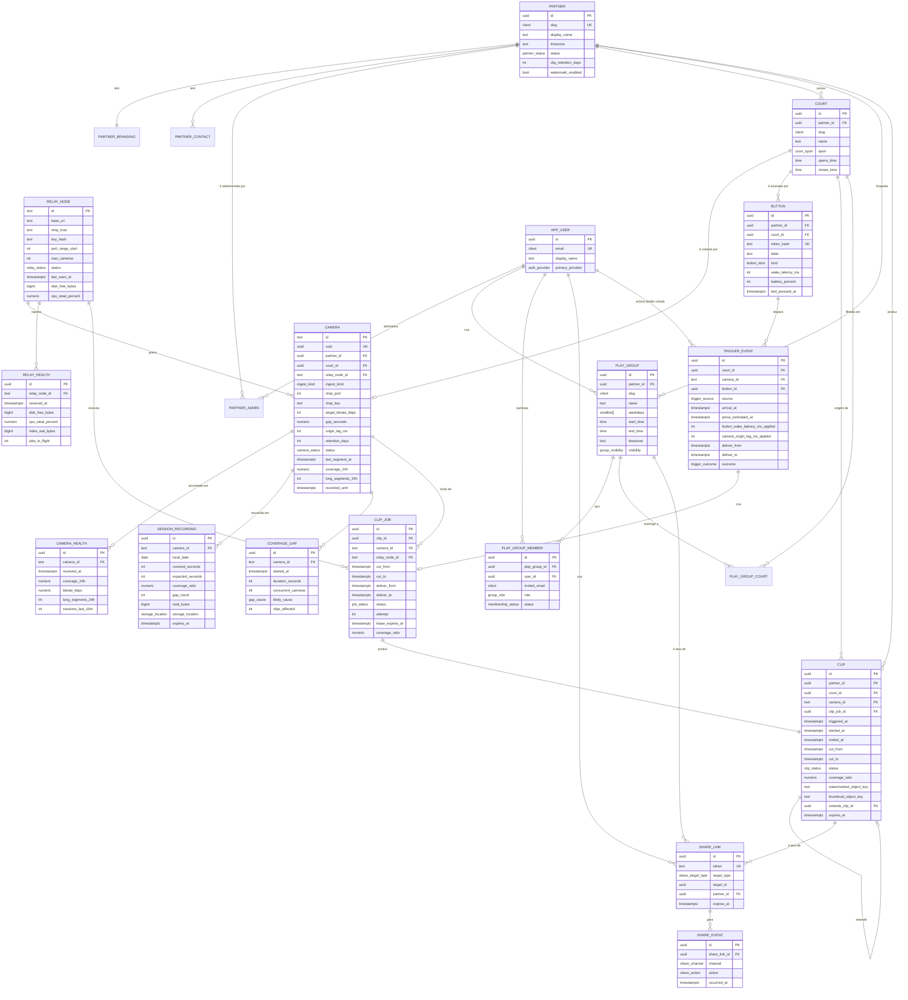

# Modelo de dados — Replay já 2.0

> Status: proposta para o piloto (**v2 — arquitetura de relay**, sem computador de borda).
> Complementa `docs/adr/0001-stack-e-arquitetura.md`.
> Banco: **PostgreSQL (Neon)**, acessado com `pg` puro. Nomes de tabelas e colunas em `snake_case` inglês (padrão do ecossistema TS); descrições em pt-BR.

## Sumário

1. [Convenções gerais](#1-convenções-gerais)
2. [Diagrama ER](#2-diagrama-er)
3. [Entidades](#3-entidades)
4. [Política de fuso horário](#4-política-de-fuso-horário)
5. [Política de retenção](#5-política-de-retenção)
6. [Consultas centrais](#6-consultas-centrais)
7. [Autorização — na camada de API, sem RLS](#7-autorização--na-camada-de-api-sem-rls)
8. [Volumetria estimada](#8-volumetria-estimada)

---

## 1. Convenções gerais

| Convenção | Decisão | Por quê |
|---|---|---|
| Chave primária | `uuid` — **UUIDv7** gerado na aplicação (`uuidv7` npm) para tabelas de alto volume (`clip`, `clip_job`, `trigger_event`, `share_event`, `camera_health`); `gen_random_uuid()` (v4) para tabelas de cadastro | UUIDv7 é ordenável por tempo → índices B-tree sem fragmentação, e o id já é um cursor de paginação |
| Timestamps | **sempre `timestamptz`**, gravados em UTC. Nunca `timestamp` sem fuso | Ver §4 |
| Horários "de parede" (ex.: grupo joga 20h) | `time` (sem fuso) + `timezone` (IANA) na entidade dona | Ver §4 |
| Nomes de coluna de tempo | `*_at` = instante (`timestamptz`); `*_time` = hora local (`time`); `*_date` = data local (`date`) | |
| Soft delete | `deleted_at timestamptz NULL` em `clip`, `play_group`, `court`, `camera`. Hard delete só por expurgo de retenção/LGPD | Permite "desfazer" e auditoria |
| Auditoria | `created_at timestamptz NOT NULL DEFAULT now()`, `updated_at timestamptz NOT NULL DEFAULT now()` (trigger `set_updated_at`) em todas as tabelas de cadastro | |
| Enums | `CREATE TYPE ... AS ENUM` nativo do Postgres, com prefixo do domínio (`clip_status`, `camera_status`) | Validação no banco + tipos gerados no TS |
| Dinheiro | Não há neste modelo (cobrança do parceiro é fora do produto no piloto) | |
| Objetos de mídia | O banco guarda **chave de objeto** (`bucket` + `object_key`), nunca URL absoluta. A URL é montada/assinada no momento da leitura | Permite trocar CDN/bucket sem migração; URLs assinadas expiram |
| Migrations | Arquivos `.sql` numerados em `db/migrations/` com bloco `-- down`, aplicados por um runner de ~40 linhas contra `schema_migrations`. **`pg` puro, sem ORM** — justificativa na ADR §4.3 | |
| Extensões | `pgcrypto` (gen_random_uuid), `citext` (e-mail), `pg_trgm` (busca por nome de arena/grupo), `btree_gist` (constraints de intervalo) | |

### Escala de leitura

`partner_id` é **desnormalizado** em `clip`, `clip_job`, `session_recording`, `camera`, `button`, `play_group` e `share_link`. Isso custa uma coluna e vale por dois motivos: (a) evita join na consulta mais quente do produto (§6.1) e (b) torna o escopo por parceiro uma cláusula `WHERE` indexada em toda consulta — que, sem RLS, é a única barreira que existe (§7).

---

## 2. Diagrama ER



> **O que saiu do diagrama e por quê.** `DEVICE`, `DEVICE_HEARTBEAT`, `DEVICE_COMMAND` e
> `SESSION_SEGMENT` existiam para um computador de borda que não existe mais. `SESSION_SEGMENT`
> em especial merece nota: o índice de segmentos é o SQLite **do relay**, e espelhá-lo aqui
> seriam ~175 mil linhas por câmera por ano num banco que nunca as consultaria. O Postgres
> guarda o resumo diário (`SESSION_RECORDING`) e os buracos (`COVERAGE_GAP`), que é o que o
> produto e o suporte realmente leem.

## 3. Entidades

### 3.1 `partner` — arena / parceiro (cliente pagante)

| Coluna | Tipo | Regras |
|---|---|---|
| `id` | `uuid` PK | `gen_random_uuid()` |
| `slug` | `citext` | **UNIQUE**, 3–40 chars, `^[a-z0-9]+(-[a-z0-9]+)*$`, não pode estar em `reserved_slug`. É o caminho público `replayja.com.br/<slug>` |
| `legal_name` | `text NOT NULL` | Razão social (contrato) |
| `display_name` | `text NOT NULL` | "Arena Calabouço" — o que aparece no site |
| `document` | `text NULL` | CNPJ, só dígitos, `CHECK (document ~ '^\d{14}$')` |
| `timezone` | `text NOT NULL DEFAULT 'America/Sao_Paulo'` | IANA; `CHECK (now() AT TIME ZONE timezone IS NOT NULL)` valida o nome |
| `city` / `state` | `text` / `char(2)` | Para SEO da página pública |
| `status` | `partner_status` | `pending` \| `active` \| `suspended` \| `churned` |
| `clip_retention_days` | `int NOT NULL DEFAULT 90` | **90 dias — decidido.** `CHECK BETWEEN 1 AND 365`. O padrão cobre a temporada inteira de uma pelada; o custo é ~3× o de 30 dias e continua pequeno diante do relay (§8) |
| `session_retention_days` | `int NOT NULL DEFAULT 7` | Retenção da sessão completa **no disco do relay**. `CHECK BETWEEN 1 AND 30`. 3 dias é o degrau enxuto (ADR §9) |
| `watermark_enabled` | `bool NOT NULL DEFAULT true` | O parceiro pode desligar (PRD §4) |
| `public_page_enabled` | `bool NOT NULL DEFAULT true` | Se falso, `/slug` responde 404 |
| `contracted_at` / `activated_at` | `timestamptz NULL` | |
| `created_at` / `updated_at` / `deleted_at` | `timestamptz` | |

Índices: `partner_slug_key` (UNIQUE em `slug`), `partner_status_idx (status) WHERE deleted_at IS NULL`, `partner_display_name_trgm_idx USING gin (display_name gin_trgm_ops)` (busca "encontrar arena" na home).

**Regras de slug** (aplicadas na API e por constraint):
- Normalização: minúsculas, sem acentos (NFD + remoção de diacríticos), espaços → `-`, colapsar `-` repetidos, remover `-` nas pontas.
- Proibido: começar/terminar com `-`, ter `--`, conter `.` ou `_`, ter menos de 3 ou mais de 40 caracteres.
- Proibido: constar em `reserved_slug` (§3.21).
- Slug é **imutável** após a arena ir ao ar. Renomear cria `partner_slug_alias` (tabela de 2 colunas: `slug`, `partner_id`) e a rota antiga responde `308 Permanent Redirect`.

---

### 3.2 `partner_branding` — identidade visual e marca d'água (1:1 com `partner`)

| Coluna | Tipo | Regras |
|---|---|---|
| `partner_id` | `uuid` PK/FK → `partner(id)` ON DELETE CASCADE | 1:1 |
| `logo_object_key` | `text NULL` | PNG/SVG, ≤ 2 MB, usado no cabeçalho da página pública |
| `logo_dark_object_key` | `text NULL` | Variante para fundo escuro |
| `watermark_object_key` | `text NULL` | **PNG 24-bit com alpha**, exatamente 512×512 ou 1024×256, ≤ 512 KB. É o arquivo que o relay baixa para o passe de marca d'água |
| `watermark_version` | `int NOT NULL DEFAULT 1` | Incrementado a cada troca; o relay guarda o PNG em cache por versão e rebusca quando muda |
| `watermark_position` | `watermark_position NOT NULL DEFAULT 'bottom_right'` | `top_left` \| `top_right` \| `bottom_left` \| `bottom_right` |
| `watermark_opacity` | `numeric(3,2) NOT NULL DEFAULT 0.85` | `CHECK BETWEEN 0.2 AND 1.0` |
| `watermark_scale` | `numeric(3,2) NOT NULL DEFAULT 0.12` | Fração da largura do vídeo. `CHECK BETWEEN 0.05 AND 0.30` |
| `watermark_margin` | `numeric(3,2) NOT NULL DEFAULT 0.03` | Fração da largura |
| `primary_color` / `accent_color` | `text` | `CHECK (~ '^#[0-9a-f]{6}$')`. Usadas como CSS custom properties na página do parceiro |
| `og_image_object_key` | `text NULL` | Imagem 1200×630 de fallback para Open Graph |
| `tagline` | `text NULL` | ≤ 120 chars, aparece no `<meta description>` e no card do WhatsApp |

> **Contrato com o relay**: `watermark_version` viaja em cada `clip_job`, junto com a URL do PNG. O relay mantém um cache local por versão e só baixa quando encontra uma versão nova. Como a marca d'água é aplicada na nuvem (ADR §5) e o recorte bruto fica 48 h em disco, **trocar o logo permite reprocessar clipes recentes** — o que não era possível no desenho de borda.

---

### 3.3 `partner_contact` — contatos da arena (aba "contato" da página pública)

| Coluna | Tipo | Regras |
|---|---|---|
| `id` | `uuid` PK | |
| `partner_id` | `uuid` FK | |
| `kind` | `contact_kind` | `whatsapp` \| `phone` \| `email` \| `instagram` \| `website` \| `address` \| `maps` |
| `label` | `text NULL` | "Recepção", "Reservas" |
| `value` | `text NOT NULL` | Telefone em E.164 (`+5511999998888`) quando `kind IN ('whatsapp','phone')` |
| `is_primary` | `bool NOT NULL DEFAULT false` | |
| `display_order` | `int NOT NULL DEFAULT 0` | |

Índice: `partner_contact_partner_idx (partner_id, display_order)`.
Constraint: `UNIQUE (partner_id, kind) WHERE is_primary` (índice parcial único) — no máximo um primário por tipo.

---

### 3.4 `partner_admin` — quem administra a arena

| Coluna | Tipo | Regras |
|---|---|---|
| `id` | `uuid` PK | |
| `partner_id` | `uuid` FK | |
| `user_id` | `uuid` FK → `app_user(id)` NULL | Nulo enquanto o convite está pendente |
| `invited_email` | `citext NOT NULL` | Sempre preenchido (é a chave do convite) |
| `role` | `partner_role NOT NULL` | `owner` (contrato, pode adicionar admins) \| `manager` (branding, dispositivos, métricas) \| `viewer` (só métricas) |
| `status` | `membership_status NOT NULL DEFAULT 'invited'` | `invited` \| `active` \| `revoked` |
| `invite_token_hash` | `text NULL` | SHA-256 do token; token cru só existe no e-mail |
| `invite_expires_at` | `timestamptz NULL` | +7 dias |
| `accepted_at` | `timestamptz NULL` | |

Constraints: `UNIQUE (partner_id, invited_email)`; `UNIQUE (partner_id, user_id) WHERE user_id IS NOT NULL`; `CHECK (status <> 'active' OR user_id IS NOT NULL)`.
Regra: todo `partner` precisa de ≥ 1 `owner` ativo — verificado por trigger `AFTER UPDATE/DELETE`.

---

### 3.5 `court` — quadra

| Coluna | Tipo | Regras |
|---|---|---|
| `id` | `uuid` PK | |
| `partner_id` | `uuid` FK | |
| `slug` | `citext NOT NULL` | Único **dentro** do parceiro. Usado em query string (`?quadra=quadra-1`), não em caminho |
| `name` | `text NOT NULL` | "Quadra 1", "Society Coberta" |
| `sport` | `court_sport NOT NULL DEFAULT 'society'` | `society` \| `beach_tennis` \| `futevolei` \| `padel` \| `volei` \| `tenis` \| `basquete` \| `outro` |
| `surface` | `text NULL` | "areia", "grama sintética" |
| `display_order` | `int NOT NULL DEFAULT 0` | |
| `active` | `bool NOT NULL DEFAULT true` | |
| `opens_time` / `closes_time` | `time NULL` | Hora local de funcionamento — usada para (a) decidir se a sessão contínua deve estar gravando e (b) alertar "quadra offline em horário de operação" |
| `deleted_at` | `timestamptz NULL` | |

Índices: `UNIQUE (partner_id, slug)`, `court_partner_idx (partner_id, display_order) WHERE deleted_at IS NULL`.

---

### 3.6 `relay_node` — a máquina que grava

Não há equipamento nosso na arena. A gravação acontece em um servidor nosso na AWS, e esta tabela é o inventário dele.

| Coluna | Tipo | Regras |
|---|---|---|
| `id` | `text` PK | Curto e legível: `relay-1`, `relay-2`. Entra em nome de host e em log |
| `base_url` | `text NOT NULL` | `https://relay-1.replayja.com.br` |
| `rtmp_host` | `text NOT NULL` | Nome que vai na configuração da câmera. **Separado do `base_url`** para permitir trocar o IP/instância sem reconfigurar câmera |
| `region` | `text NOT NULL DEFAULT 'sa-east-1'` | |
| `key_hash` | `text NOT NULL` | SHA-256 da `relay_key` |
| `key_version` | `int NOT NULL DEFAULT 1` | |
| `port_range_start` / `port_range_end` | `int NOT NULL` | Faixa de portas RTMP, ex.: 19350–19449. Uma porta por câmera enquanto o ingest for `ffmpeg -listen` |
| `max_cameras` | `int NOT NULL DEFAULT 24` | Limite de planejamento; acima disso, provisionar outro relay ou migrar para ingest único |
| `status` | `relay_status NOT NULL DEFAULT 'provisioning'` | `provisioning` \| `active` \| `draining` \| `retired` |
| `last_seen_at` | `timestamptz NULL` | Último `POST /relay/health` |
| `agent_version` | `text NULL` | |
| `disk_total_bytes` / `disk_free_bytes` | `bigint NULL` | |
| `pruning_active` | `bool NOT NULL DEFAULT false` | Poda por espaço encurtando a retenção — sinal de disco subdimensionado |
| `cpu_steal_percent` | `numeric(5,2) NULL` | **Sinal vital em instância burstable**. Ver §3.7 |
| `index_wal_bytes` | `bigint NULL` | WAL do SQLite do relay |
| `jobs_in_flight` / `job_slots` | `int` | |
| `notes` | `text NULL` | |

Índices: `relay_node_status_idx (status, last_seen_at)`.

Regra operacional que vale registrar no banco e no runbook: **o relay do Replay já roda em máquina separada da do Sentinela.** Aquela é produção com clientes pagantes, já mediu 53% de CPU steal e não tem folga para absorver uma carga nova.

> **Por que a porta nunca é reutilizada**: `port_range_next` é um contador monotônico por relay, não uma busca por buraco. Reaproveitar a porta de uma câmera removida faz uma câmera antiga, mal desconfigurada no app do cliente, empurrar vídeo para o lugar de outra — e o vídeo errado aparece na quadra errada.

---

### 3.7 `camera` — a câmera IP da quadra

Substitui a entidade `device` do desenho com computador de borda. A câmera é um equipamento de terceiro que só sabe fazer uma coisa: empurrar RTMP.

| Coluna | Tipo | Regras |
|---|---|---|
| `id` | `text` PK | **Não é UUID**: `^[a-z0-9]{6,32}$`, ex.: `rjq1a7f3c92b`. Vira nome de diretório em disco (`/srv/rec/<id>/`) e segmento de URL, então é restrito de propósito |
| `uuid` | `uuid NOT NULL UNIQUE` | Chave técnica para FKs |
| `partner_id` | `uuid` FK NOT NULL | |
| `court_id` | `uuid` FK NULL | **Sem quadra, o relay não grava.** É o equivalente ao "sem destino não há gravador" do Sentinela: a câmera criada entra numa fila "Câmeras novas" no painel |
| `relay_node_id` | `text` FK NOT NULL | |
| `name` | `text NOT NULL` | "Quadra 1 — fundo" |
| `ingest_kind` | `ingest_kind NOT NULL DEFAULT 'rtmp_push'` | `rtmp_push` \| `rtsp_pull` (plano B / bancada) |
| `rtmp_port` | `int NULL` | **UNIQUE por relay**, alocado do contador monotônico |
| `rtmp_key` | `text NULL` | A chave que o instalador cola no app da câmera. Ver nota de segurança abaixo |
| `rtsp_url` | `text NULL` | Contém credencial. Nunca logar, nunca devolver em API pública |
| `width` / `height` / `fps` | `int` | Padrão 1920/1080/30 |
| `target_bitrate_kbps` | `int NOT NULL DEFAULT 3000` | **O único controle real de custo.** A mesma stream vira o clipe e a sessão |
| `gop_seconds` | `numeric(3,1) NOT NULL DEFAULT 1.0` | GOP curto = corte preciso. `CHECK BETWEEN 0.5 AND 4.0` |
| `segment_seconds` | `numeric(3,1) NOT NULL DEFAULT 2.0` | |
| `origin_lag_ms` | `int NOT NULL DEFAULT 3000` | **Atraso medido entre a cena e a chegada ao relay.** Ver §4.1 |
| `origin_lag_measured_at` | `timestamptz NULL` | |
| `retention_days` | `int NOT NULL DEFAULT 7` | Retenção da sessão **no disco do relay**. `CHECK BETWEEN 1 AND 30` |
| `recording_window_opens` / `recording_window_closes` | `time NULL` | Janela local retida. Fora dela o relay poda após `prune_after_hours`. Herdadas de `court` se nulas |
| `prune_after_hours` | `int NOT NULL DEFAULT 6` | |
| `min_coverage_ratio` | `numeric(3,2) NOT NULL DEFAULT 0.60` | Abaixo disso, recusa o clipe em vez de entregar capenga |
| `status` | `camera_status NOT NULL DEFAULT 'provisioned'` | `provisioned` \| `recording` \| `degraded` \| `down` \| `disabled` |
| `enabled` | `bool NOT NULL DEFAULT true` | |
| `first_connected_at` | `timestamptz NULL` | Nulo = a câmera nunca conectou; alerta de instalação incompleta |
| `last_segment_at` | `timestamptz NULL` | Derivado do `POST /relay/health`. **É o heartbeat** |
| `coverage_24h` | `numeric(4,3) NULL` | |
| `observed_bitrate_kbps` | `numeric(8,1) NULL` | |
| `long_segments_24h` | `int NOT NULL DEFAULT 0` | Segmentos com `EXTINF > 10 s` — assinatura de buraco de uplink |
| `recorded_until` | `timestamptz NULL` | Instante mais antigo ainda em disco. Define o alcance do "estender lance" |
| `deleted_at` | `timestamptz NULL` | |

Índices: `UNIQUE (relay_node_id, rtmp_port) WHERE rtmp_port IS NOT NULL`, `camera_partner_idx (partner_id) WHERE deleted_at IS NULL`, `camera_court_idx (court_id)`, `camera_health_idx (status, last_segment_at)`.

> **Segurança da `rtmp_key`.** É um segredo fraco por natureza: o RTMP é texto claro e sem autenticação. A chave nasce no app, mora no Postgres e viaja por HTTPS até o relay (`GET /relay/cameras` com `x-relay-key`). Quem tiver leitura do banco passa a poder empurrar vídeo para uma câmera nossa. A inversão de custódia vale porque preserva a propriedade que mais importa: **o app continua sem poder escrever no relay** — quem pergunta é o relay, e a resposta é uma lista, nunca um comando. Sem RLS, a proteção é a projeção explícita: a coluna nunca entra numa consulta de `db/queries/` que atenda usuário, `SELECT *` é proibido ali, e o CI confere (§7.3).

> **O relay nunca apaga a configuração de uma câmera que sumiu da lista.** Apagar a chave obrigaria a redigitá-la presencialmente no app da câmera, na quadra. Encerrar uma câmera é uma ação explícita e separada.

---

### 3.8 `camera_health` — amostras de cobertura (série temporal)

Substitui `device_heartbeat`. A diferença conceitual importa: não é um agente nosso afirmando que está bem, é a **medição do que existe gravado em disco**.

| Coluna | Tipo | Regras |
|---|---|---|
| `id` | `uuid` PK (UUIDv7) | |
| `camera_id` | `text` FK | |
| `relay_node_id` | `text` FK | |
| `received_at` | `timestamptz NOT NULL DEFAULT now()` | |
| `recorder_up` | `bool NOT NULL` | O `ffmpeg` da câmera está de pé |
| `last_segment_at` | `timestamptz NULL` | |
| `coverage_1h` / `coverage_24h` | `numeric(4,3)` | Fração do período com segmento em disco |
| `bitrate_kbps` | `numeric(8,1) NULL` | |
| `gb_per_day` | `numeric(6,2) NULL` | |
| `long_segments_24h` | `int NOT NULL DEFAULT 0` | |
| `longest_gap_seconds_24h` | `int NULL` | |
| `sessions_last_10m` | `int NOT NULL DEFAULT 0` | `≥ 4` indica uplink em rajadas |
| `disk_bytes` | `bigint NULL` | |

Índice: `camera_health_time_idx (camera_id, received_at DESC)`. **Retenção: 30 dias** (a série alimenta o gráfico de cobertura do painel do parceiro, que é argumento de renovação).

#### Como ler cobertura (números medidos na frota do Sentinela, 19–24 câmeras, set/2026)

| Faixa | Leitura |
|---|---|
| 0,95–0,96 | Câmera saudável |
| ~0,92 | Mediana da frota |
| < 0,90 | **Problema real, não ruído** |

Julgar **sempre** pela janela de 24 h. A de 1 h engana logo após qualquer reinício da frota, que abre 30–90 s de lacuna por câmera.

### 3.9 `relay_health` — amostras da máquina

| Coluna | Tipo | Observação |
|---|---|---|
| `id` | `uuid` PK (UUIDv7) | |
| `relay_node_id` | `text` FK | |
| `received_at` | `timestamptz` | |
| `disk_total_bytes` / `disk_free_bytes` | `bigint` | Alerta em `DISK_HIGH` (85%) |
| `pruning_active` | `bool` | |
| `cpu_load_1m` | `numeric(5,2)` | |
| `cpu_steal_percent` | `numeric(5,2)` | **Alerta acima de 20% sustentado.** A Lightsail do Sentinela chegou a 53% em 04/09/2026, sobrando ~1,9 de 4 vCPU: passou do baseline de burst e o hipervisor estrangulou |
| `recorder_cpu_percent` / `worker_cpu_percent` | `numeric(6,2)` | Separa quem consome |
| `index_wal_bytes` | `bigint` | **Alerta acima de 512 MB.** O WAL do SQLite só cresce sem parar quando o checkpoint está bloqueado por um cursor aberto — nunca por volume. O Sentinela teve 7,1 GB contra um banco de 703 MB em 06/09/2026, 19 h sem um único checkpoint, sem um erro em lugar nenhum |
| `index_db_bytes` | `bigint` | |
| `jobs_in_flight` / `job_slots` / `jobs_failed_1h` | `int` | |
| `p50_cut_ms` / `p50_encode_ms` | `int` | Capacidade de corte e de marca d'água |

**Retenção: 30 dias.**

---

### 3.10 `button` — botão da quadra (dispositivo de rede)

Sem computador de borda, o botão deixa de ser um rádio pareado e passa a ser um cliente HTTP.

| Coluna | Tipo | Regras |
|---|---|---|
| `id` | `uuid` PK | |
| `partner_id` / `court_id` | `uuid` FK NOT NULL | O mapeamento botão → quadra continua sendo o dado central |
| `token_hash` | `text NOT NULL UNIQUE` | SHA-256 do token de webhook. O token cru aparece **uma vez**, na URL mostrada no provisionamento |
| `token_last4` | `text NOT NULL` | Para o operador conferir qual botão é qual sem revelar o segredo |
| `label` | `text NOT NULL` | "Botão do gol norte" |
| `kind` | `button_kind NOT NULL DEFAULT 'wifi_webhook'` | `wifi_webhook` \| `zigbee_hub` \| `virtual` |
| `model` | `text NULL` | "Shelly Button 1" |
| `active` | `bool NOT NULL DEFAULT true` | Revogação é um `UPDATE` |
| `wake_latency_ms` | `int NOT NULL DEFAULT 1500` | Tempo entre o dedo e a chegada do `POST`: o botão acorda do sono profundo, associa no Wi-Fi, resolve DNS, faz TLS. Medido na instalação. `CHECK BETWEEN 0 AND 10000` |
| `wake_latency_measured_at` | `timestamptz NULL` | |
| `battery_percent` | `int NULL` | Só quando o modelo reporta (query param `?bat=`) |
| `battery_reported_at` | `timestamptz NULL` | |
| `last_signal_at` | `timestamptz NULL` | Qualquer requisição, inclusive recusada |
| `last_pressed_at` | `timestamptz NULL` | Gatilho aceito |
| `last_event_counter` | `bigint NULL` | `?evt=` do próprio botão, usado como chave de idempotência |
| `press_count_total` | `bigint NOT NULL DEFAULT 0` | |

Índices: `UNIQUE (token_hash)`, `button_court_idx (court_id) WHERE active`, `button_silent_idx (partner_id, last_pressed_at)`.

> **Não há heartbeat de botão.** Um dispositivo de bateria que dorme não pode pagar por isso — um heartbeat de 30 s mataria a pilha em dias. A liveness é inferida: `silent_for_days` (dias sem acionamento em horário de operação numa quadra com histórico) dispara alerta em 3 dias. É um sinal fraco e assumido como tal; o sinal forte é a cobertura da câmera, que não depende de bateria.

---

### 3.11 `trigger_event` — auditoria de cada acionamento

| Coluna | Tipo | Regras |
|---|---|---|
| `id` | `uuid` PK (UUIDv7) | |
| `partner_id` / `court_id` | `uuid` FK | |
| `camera_id` | `text` FK NULL | |
| `button_id` | `uuid` FK NULL | Só para `source = 'physical_button'` |
| `source` | `trigger_source NOT NULL` | `physical_button` \| `virtual_button` \| `api` \| `ai` (futuro) |
| `requested_by_user_id` | `uuid` FK NULL | Botão virtual: quem clicou |
| `idempotency_key` | `text NULL` | `<button_id>:<evt>` quando o botão manda contador; `Idempotency-Key` no botão virtual. `UNIQUE` parcial |
| `arrival_at` | `timestamptz NOT NULL DEFAULT clock_timestamp()` | **A fonte da verdade do tempo.** Relógio do servidor, no instante em que o `POST` chegou |
| `press_estimated_at` | `timestamptz NOT NULL` | `arrival_at − button.wake_latency_ms` |
| `button_wake_latency_ms_applied` | `int NOT NULL DEFAULT 0` | |
| `camera_origin_lag_ms_applied` | `int NOT NULL DEFAULT 0` | |
| `deliver_from` / `deliver_to` | `timestamptz NOT NULL` | Janela pedida ao relay, já com as duas latências aplicadas |
| `cut_from` / `cut_to` | `timestamptz NOT NULL` | Janela bruta, mais larga |
| `outcome` | `trigger_outcome NOT NULL DEFAULT 'accepted'` | `accepted` \| `rejected_cooldown` \| `rejected_no_coverage` \| `rejected_camera_unknown` \| `rejected_button_revoked` \| `rejected_relay_down` |
| `clip_id` | `uuid` FK NULL | |
| `clip_job_id` | `uuid` FK NULL | |
| `user_agent` / `source_ip_hash` | `text NULL` | Do botão; ajuda a diagnosticar botão clonado |

Índices: `UNIQUE (idempotency_key) WHERE idempotency_key IS NOT NULL`, `trigger_event_court_time_idx (court_id, arrival_at DESC)`, `trigger_event_outcome_idx (outcome, arrival_at DESC) WHERE outcome <> 'accepted'`.
**Retenção: 90 dias.**

> **O que sumiu e por quê**: `client_event_id`, `triggered_at_raw` e `clock_offset_ms_applied` existiam para corrigir o relógio de um computador de borda. Sem borda, não há relógio para corrigir — o carimbo é do nosso servidor. O problema de tempo não desapareceu, mudou de natureza: virou **latência**, tratada em §4.1.

---

### 3.12 `clip_job` — o corte a executar

| Coluna | Tipo | Regras |
|---|---|---|
| `id` | `uuid` PK (UUIDv7) | |
| `clip_id` | `uuid` FK NOT NULL UNIQUE | |
| `camera_id` | `text` FK NOT NULL | |
| `relay_node_id` | `text` FK NOT NULL | |
| `trigger_event_id` | `uuid` FK NULL | |
| `cut_from` / `cut_to` | `timestamptz NOT NULL` | Janela bruta (padrão `[t−32 s, t+6 s]`) |
| `deliver_from` / `deliver_to` | `timestamptz NOT NULL` | Trecho entregue (padrão `[t−24 s, t+1 s]`) |
| `status` | `job_status NOT NULL DEFAULT 'pending'` | `pending` \| `claimed` \| `cutting` \| `processing` \| `uploading` \| `done` \| `failed` |
| `priority` | `int NOT NULL DEFAULT 10` | |
| `attempt` | `int NOT NULL DEFAULT 0` | `CHECK <= 5` |
| `claimed_at` | `timestamptz NULL` | |
| `lease_expires_at` | `timestamptz NULL` | `claimed_at + 120 s`. Vencido sem confirmação volta para `pending` — é o que cobre o relay morrer no meio de um corte |
| `coverage_ratio` | `numeric(4,3) NULL` | Reportado pelo relay |
| `cut_ms` / `encode_ms` | `int NULL` | |
| `error_code` | `text NULL` | `no_coverage` \| `ffmpeg_failed` \| `disk_full` \| `slots_full` \| `timeout` \| `camera_unknown` |
| `error` | `text NULL` | |
| `expires_at` | `timestamptz NOT NULL` | `created_at + 30 min` |
| `extends_clip_id` | `uuid` FK NULL | Preenchido quando o job veio de `POST /clips/{id}/extend` |

Índice de reivindicação (o único que importa):
```sql
CREATE INDEX clip_job_claimable_idx ON clip_job (relay_node_id, priority DESC, created_at)
  WHERE status = 'pending';
```

```sql
-- Reivindicação atômica; dois relays nunca pegam o mesmo job
UPDATE clip_job SET status='claimed', claimed_at=now(),
       lease_expires_at = now() + interval '120 seconds', attempt = attempt + 1
WHERE id IN (
  SELECT id FROM clip_job
  WHERE relay_node_id = $1 AND status = 'pending' AND expires_at > now()
  ORDER BY priority DESC, created_at
  LIMIT $2 FOR UPDATE SKIP LOCKED)
RETURNING *;
```

**Retenção: 30 dias.**

> **Um job atrasado não é perigoso neste desenho** — e esta é uma das maiores simplificações que a mudança trouxe. A janela é absoluta e a sessão está gravada, então executar o corte cinco minutos depois produz **exatamente o mesmo clipe**. No desenho com computador de borda, o comando de gatilho tinha de expirar em 15 s, porque chegar atrasado significava capturar o lance errado.

---

### 3.13 `clip` — o lance

| Coluna | Tipo | Regras |
|---|---|---|
| `id` | `uuid` PK (**UUIDv7**) | |
| `partner_id` / `court_id` | `uuid` FK NOT NULL | Desnormalizados |
| `camera_id` | `text` FK NOT NULL | |
| `trigger_event_id` | `uuid` FK NULL UNIQUE | |
| `clip_job_id` | `uuid` FK NULL | |
| `triggered_at` | `timestamptz NOT NULL` | = `trigger_event.press_estimated_at`. **Coluna de ordenação e filtro do produto** |
| `started_at` / `ended_at` | `timestamptz NOT NULL` | Trecho realmente entregue, como o relay reportou em `actualFrom`/`actualTo` |
| `cut_from` / `cut_to` | `timestamptz NOT NULL` | Janela bruta ainda em disco no relay — origem do "estender lance" |
| `duration_seconds` | `numeric(5,2) NOT NULL` | `CHECK (> 0 AND <= 120)` |
| `status` | `clip_status NOT NULL DEFAULT 'pending'` | `pending` → `cutting` → `processing` → `uploading` → `ready` \| `partial` \| `failed` \| `expired` |
| `coverage_ratio` | `numeric(4,3) NULL` | `1` = janela íntegra. `< 1` = buraco de uplink durante o lance |
| `failure_reason` | `text NULL` | |
| `storage_bucket` | `text NOT NULL DEFAULT 'replayja-clips'` | |
| `watermarked_object_key` | `text NULL` | Arquivo entregue |
| `source_object_key` | `text NULL` | Original sem marca, quando o parceiro contratou |
| `thumbnail_object_key` / `preview_object_key` / `og_object_key` | `text NULL` | |
| `width` / `height` / `fps` / `codec` | | |
| `size_bytes` | `bigint NULL` | |
| `checksum_sha256` | `text NULL` | |
| `watermark_applied` | `bool NOT NULL DEFAULT false` | |
| `watermark_version` | `int NULL` | Qual PNG foi usado — permite reprocessamento dirigido |
| `extends_clip_id` | `uuid` FK NULL | Clipe do qual este é um recorte estendido |
| `view_count` / `download_count` / `share_count` | `int NOT NULL DEFAULT 0` | Atualizados por job, nunca no caminho de leitura |
| `expires_at` | `timestamptz NOT NULL` | `triggered_at + partner.clip_retention_days` |
| `pinned` | `bool NOT NULL DEFAULT false` | Compartilhado ou baixado → retenção estendida |
| `deleted_at` | `timestamptz NULL` | |

Índices (inalterados na forma — a consulta central não mudou):
```sql
CREATE INDEX clip_partner_time_idx ON clip (partner_id, triggered_at DESC, id DESC)
  WHERE status IN ('ready','partial') AND deleted_at IS NULL;
CREATE INDEX clip_court_time_idx   ON clip (court_id, triggered_at DESC, id DESC)
  WHERE status IN ('ready','partial') AND deleted_at IS NULL;
CREATE INDEX clip_expiry_idx ON clip (expires_at)
  WHERE deleted_at IS NULL AND status <> 'expired';
CREATE INDEX clip_stuck_idx ON clip (status, created_at)
  WHERE status IN ('pending','cutting','processing','uploading');
```

> `partial` **aparece** na busca. Um lance com 3 segundos faltando no meio ainda é o lance do atleta; escondê-lo seria pior. O app rotula ("faltam ~3 s — a internet da arena oscilou") e o painel do parceiro conta essas ocorrências, porque a correção é do lado dele.

---

### 3.14 `session_recording` — a gravação contínua

**Mudança estrutural**: a sessão completa vive **no disco do relay**, indexada pelo SQLite dele. O Postgres guarda apenas um **resumo diário por câmera** — não há `session_segment` espelhado aqui. Duplicar 175 mil linhas de segmento por câmera por ano num banco que não as consulta seria custo puro.

| Coluna | Tipo | Regras |
|---|---|---|
| `id` | `uuid` PK | |
| `partner_id` / `court_id` | `uuid` FK | |
| `camera_id` | `text` FK | |
| `relay_node_id` | `text` FK | |
| `local_date` | `date NOT NULL` | Data no fuso da arena. `UNIQUE (camera_id, local_date)` |
| `first_segment_at` / `last_segment_at` | `timestamptz NULL` | |
| `covered_seconds` | `int NOT NULL DEFAULT 0` | Segundos com gravação dentro da janela de operação |
| `expected_seconds` | `int NOT NULL DEFAULT 0` | Duração da janela de operação daquele dia |
| `coverage_ratio` | `numeric(4,3) GENERATED` | `covered / NULLIF(expected,0)` |
| `gap_count` | `int NOT NULL DEFAULT 0` | Buracos > 10 s |
| `longest_gap_seconds` | `int NOT NULL DEFAULT 0` | |
| `total_bytes` | `bigint NOT NULL DEFAULT 0` | |
| `avg_bitrate_kbps` | `numeric(8,1) NULL` | |
| `storage_location` | `storage_location NOT NULL DEFAULT 'relay'` | `relay` \| `r2` \| `purged` |
| `expires_at` | `timestamptz NOT NULL` | `first_segment_at + camera.retention_days` |
| `archived_at` | `timestamptz NULL` | Preenchido se o dia foi promovido para o armazenamento de objetos (futuro: material de IA) |
| `retained_reason` | `text NULL` | |

Índices: `UNIQUE (camera_id, local_date)`, `session_recording_partner_date_idx (partner_id, local_date DESC)`, `session_recording_coverage_idx (coverage_ratio) WHERE coverage_ratio < 0.9`.

### 3.15 `coverage_gap` — buracos de gravação

Materializa o que o painel do parceiro precisa mostrar, e o que o suporte precisa para responder "por que meu lance saiu picotado".

| Coluna | Tipo | Regras |
|---|---|---|
| `id` | `uuid` PK (UUIDv7) | |
| `partner_id` / `camera_id` | FK | |
| `started_at` / `ended_at` | `timestamptz NOT NULL` | |
| `duration_seconds` | `int NOT NULL` | |
| `concurrent_cameras` | `int NOT NULL DEFAULT 1` | Quantas câmeras da mesma arena tiveram buraco no mesmo minuto |
| `likely_cause` | `gap_cause NOT NULL DEFAULT 'unknown'` | `arena_uplink` \| `camera` \| `relay` \| `unknown` |
| `clips_affected` | `int NOT NULL DEFAULT 0` | |

Índice: `coverage_gap_partner_time_idx (partner_id, started_at DESC)`.

> **Como `likely_cause` é decidido, e por que a heurística é confiável**: buracos de uplink chegam **em bando**. Na frota do Sentinela, cinco câmeras do mesmo local abriram buraco no mesmo segundo, repetidamente; e as câmeras por RTSP (puxadas de dentro da LAN) e as da Tuya não tiveram **nenhum** buraco no mesmo período, enquanto as que empurram vídeo tiveram 68 em 24 h. Regra: `concurrent_cameras > 1` na mesma arena ⇒ `arena_uplink`. Uma câmera sozinha ⇒ `camera`. Todas as câmeras de **todas** as arenas do mesmo relay ⇒ `relay`.

---

### 3.16 `app_user` — atleta / usuário final

**Não há provedor de identidade externo.** A autenticação é a portada do Sentinela (ADR §4.4): OTP de 6 dígitos com o desafio num cookie HMAC de 10 minutos — **sem tabela de desafio e sem tabela de sessão** — mais Google por OIDC manual. Esta tabela é o perfil de aplicação, e existe porque grupos, convites e posse precisam de um `id` estável.

| Coluna | Tipo | Regras |
|---|---|---|
| `id` | `uuid` PK, FK → `auth.users(id)` ON DELETE CASCADE | |
| `email` | `citext NOT NULL UNIQUE` | **Obrigatório** (PRD: captura de e-mail por grupo). Espelhado de `auth.users.email` por trigger |
| `email_verified_at` | `timestamptz NULL` | OTP verificado ou Google |
| `display_name` | `text NULL` | Opcional no cadastro — a fricção mínima é o diferencial |
| `avatar_url` | `text NULL` | Vem do Google quando disponível |
| `phone` | `text NULL` | E.164, opcional, nunca obrigatório |
| `primary_provider` | `auth_provider NOT NULL` | `email_otp` \| `google` |
| `locale` | `text NOT NULL DEFAULT 'pt-BR'` | |
| `timezone` | `text NULL` | Detectado no navegador; usado só para formatação, nunca para filtro |
| `marketing_opt_in` | `bool NOT NULL DEFAULT false` | LGPD: consentimento explícito e separado |
| `terms_accepted_at` | `timestamptz NULL` | |
| `first_partner_id` | `uuid FK NULL` | Arena pela qual o usuário entrou — métrica de atribuição para o parceiro |
| `last_login_at` | `timestamptz NULL` | |
| `deleted_at` | `timestamptz NULL` | |

Índices: `UNIQUE (email)`, `app_user_first_partner_idx (first_partner_id)`.

> **A vinculação de contas é o `upsert` por e-mail**, e é a única regra que precisa estar certa: `INSERT INTO app_user (email, ...) VALUES (...) ON CONFLICT (email) DO UPDATE SET last_login_at = now() RETURNING id`. Quem entrou por OTP na segunda e por Google na quarta cai na mesma linha, porque os dois caminhos só chegam ali com o e-mail **comprovado** — o OTP por construção, e o Google só quando `email_verified = true` (ADR §4.4). Aceitar um `id_token` sem essa checagem é tomada de conta alheia.
>
> O cookie de sessão carrega `{uid, email, exp}` e **nada de autorização**: papel de admin de arena é consultado no banco na requisição de painel, nunca guardado no cookie.

---

### 3.17 `play_group` — o grupo / "pelada" (filtro recorrente salvo)

`group` é palavra reservada em SQL; a tabela chama-se `play_group`.

| Coluna | Tipo | Regras |
|---|---|---|
| `id` | `uuid` PK | |
| `partner_id` | `uuid` FK NOT NULL | O grupo vive **dentro** de uma arena (`/<arena>/<grupo>`) |
| `created_by` | `uuid` FK → `app_user(id)` | |
| `slug` | `citext NOT NULL` | **UNIQUE por parceiro**. Mesmas regras de normalização do slug de arena; adicionalmente não pode colidir com `reserved_group_slug` (`sessoes`, `contato`, `sobre`, `admin`, `novo`) |
| `name` | `text NOT NULL` | "Fut de Segunda" |
| `description` | `text NULL` | ≤ 280 chars |
| `weekdays` | `smallint[] NOT NULL` | **ISO-8601: 1 = segunda … 7 = domingo**. `CHECK (weekdays <@ ARRAY[1,2,3,4,5,6,7] AND array_length(weekdays,1) BETWEEN 1 AND 7)` |
| `start_time` | `time NOT NULL` | Hora **local** da arena, ex.: `20:00` |
| `end_time` | `time NOT NULL` | ex.: `21:30`. Se `end_time <= start_time`, a sessão cruza a meia-noite (tratado em §6.2) |
| `timezone` | `text NOT NULL` | Copiado de `partner.timezone` na criação; coluna própria para o caso de a arena mudar de fuso (nunca acontece) e para tornar a query autocontida |
| `all_courts` | `bool NOT NULL DEFAULT true` | Se `false`, usa `play_group_court` |
| `visibility` | `group_visibility NOT NULL DEFAULT 'unlisted'` | `public` (indexável, aparece na página da arena) \| `unlisted` (só com o link) \| `private` (só membros) |
| `cover_object_key` | `text NULL` | Imagem do grupo para o card de Open Graph |
| `active_from` | `date NOT NULL DEFAULT current_date` | Não gerar sessões antes da criação |
| `member_count` | `int NOT NULL DEFAULT 1` | Desnormalizado |
| `deleted_at` | `timestamptz NULL` | |

Índices: `UNIQUE (partner_id, slug) WHERE deleted_at IS NULL`, `play_group_partner_idx (partner_id) WHERE visibility = 'public' AND deleted_at IS NULL`, `play_group_created_by_idx (created_by)`.

Regras:
- Janela máxima: `CHECK (end_time - start_time <= interval '6 hours' OR end_time <= start_time)` — evita um grupo "das 6h às 23h" que viraria um dump de toda a arena.
- Limite de 20 grupos ativos por usuário por arena (checado na API, não no banco).

### 3.18 `play_group_court` — quadras do grupo (quando não são todas)

| Coluna | Tipo |
|---|---|
| `play_group_id` | `uuid` FK, parte da PK |
| `court_id` | `uuid` FK, parte da PK |

PK composta `(play_group_id, court_id)`. `CHECK` via trigger: a quadra tem de pertencer ao mesmo `partner_id` do grupo.

### 3.19 `play_group_member` — participação e convite

| Coluna | Tipo | Regras |
|---|---|---|
| `id` | `uuid` PK | |
| `play_group_id` | `uuid` FK ON DELETE CASCADE | |
| `user_id` | `uuid` FK NULL | Nulo enquanto o convite não foi aceito |
| `invited_email` | `citext NOT NULL` | Chave do convite; para membros que entraram pelo link, é o e-mail deles |
| `invited_by` | `uuid` FK NULL | |
| `role` | `group_role NOT NULL DEFAULT 'member'` | `owner` \| `member` |
| `status` | `membership_status NOT NULL DEFAULT 'invited'` | `invited` \| `active` \| `declined` \| `removed` |
| `invite_token_hash` | `text NULL` | SHA-256 do token de 32 bytes |
| `invite_expires_at` | `timestamptz NULL` | +14 dias |
| `invited_at` / `accepted_at` / `removed_at` | `timestamptz NULL` | |
| `notify_weekly` | `bool NOT NULL DEFAULT true` | E-mail "os vídeos da pelada de ontem saíram" |

Constraints:
- `UNIQUE (play_group_id, invited_email)`
- `UNIQUE (play_group_id, user_id) WHERE user_id IS NOT NULL`
- `CHECK (status <> 'active' OR user_id IS NOT NULL)`
- Trigger: garante ≥ 1 `owner` ativo por grupo; se o último dono sai, promove o membro ativo mais antigo.
Índices: `play_group_member_user_idx (user_id) WHERE status = 'active'` (lista "meus grupos"), `play_group_member_token_idx (invite_token_hash) WHERE status = 'invited'`.

---

### 3.20 `share_link` e `share_event` — compartilhamento e métrica

#### `share_link`

| Coluna | Tipo | Regras |
|---|---|---|
| `id` | `uuid` PK | |
| `token` | `text NOT NULL UNIQUE` | 12 chars base62 (`nanoid`), URL final `replayja.com.br/s/<token>` |
| `target_type` | `share_target_type NOT NULL` | `clip` \| `session` \| `group` \| `partner` |
| `target_id` | `uuid NULL` | `clip.id` / `play_group.id` / `partner.id`. Nulo para `session` (que é um intervalo, não uma linha) |
| `partner_id` | `uuid` FK NOT NULL | Sempre preenchido — métrica do parceiro |
| `court_id` | `uuid` FK NULL | Para `target_type='session'` |
| `range_start` / `range_end` | `timestamptz NULL` | Obrigatórios quando `target_type='session'` |
| `created_by` | `uuid` FK NULL | Nulo se gerado pelo sistema |
| `channel_hint` | `share_channel NULL` | Canal que o usuário escolheu no momento da criação |
| `expires_at` | `timestamptz NULL` | Nulo = não expira. Para `clip`, alinhado a `clip.expires_at` |
| `revoked_at` | `timestamptz NULL` | |
| `view_count` | `int NOT NULL DEFAULT 0` | Contador desnormalizado |

Constraints: `CHECK (target_type <> 'session' OR (range_start IS NOT NULL AND range_end IS NOT NULL))`.
Índices: `UNIQUE (token)`, `share_link_partner_idx (partner_id, created_at DESC)`, `share_link_target_idx (target_type, target_id)`.

> Criar um `share_link` para um clipe define `clip.pinned = true` (estende retenção): um link compartilhado no WhatsApp não pode quebrar quando a retenção padrão vencer.

#### `share_event`

| Coluna | Tipo | Regras |
|---|---|---|
| `id` | `uuid` PK (UUIDv7) | |
| `share_link_id` | `uuid` FK NULL | Nulo para `action='download'` direto do app |
| `clip_id` | `uuid` FK NULL | |
| `partner_id` | `uuid` FK NOT NULL | |
| `actor_user_id` | `uuid` FK NULL | Nulo para visitante anônimo |
| `action` | `share_action NOT NULL` | `created` \| `opened` \| `played` \| `download` \| `signup_from_link` |
| `channel` | `share_channel NOT NULL DEFAULT 'unknown'` | `whatsapp` \| `instagram` \| `instagram_stories` \| `tiktok` \| `copy_link` \| `native_share` \| `direct` \| `unknown` |
| `occurred_at` | `timestamptz NOT NULL DEFAULT now()` | |
| `referrer_host` | `text NULL` | Derivado do `Referer` — confirma o canal de `opened` |
| `user_agent_family` | `text NULL` | Só a família (`WhatsApp`, `Instagram`, `Chrome Mobile`) — **não** guardar o UA completo |
| `ip_hash` | `text NULL` | HMAC-SHA256 do IP com chave rotacionada diariamente — deduplicação de views sem guardar IP (LGPD) |
| `country` / `region` | `text NULL` | Do cabeçalho geo da CDN |

Índices: `share_event_partner_time_idx (partner_id, occurred_at DESC)`, `share_event_link_idx (share_link_id, occurred_at DESC)`, `share_event_clip_idx (clip_id) WHERE clip_id IS NOT NULL`.
**Retenção: 13 meses** (permite comparação ano a ano); depois agregado em `share_daily_rollup (partner_id, day, channel, action, count)`.

> **Como o canal é medido**: o botão de compartilhar gera o link com `?c=wa` (ou `ig`, `cp`). O `channel_hint` registra a *intenção*; o `Referer`/UA da abertura registra o *fato*. As duas coisas divergem (o usuário copia o link do WhatsApp e cola no Instagram) e ambas são úteis — a intenção mede o comportamento do atleta, o fato mede o alcance real do parceiro.

---

### 3.21 `reserved_slug` — prefixos do sistema

Tabela de uma coluna (`slug citext PRIMARY KEY`) consultada na validação de `partner.slug`. Evita que o roteamento por catch-all colida com rotas do sistema.

**Conteúdo inicial** (sincronizado com o middleware do Next.js — a lista vive no código e é semeada no banco por migration, e há um teste que garante que as duas não divergem):

```
app, api, admin, auth, entrar, sair, cadastro, conta, perfil, s, p, g, c, d,
_next, static, assets, public, cdn, media, img, favicon.ico, robots.txt,
sitemap.xml, manifest.json, sw.js, .well-known, blog, ajuda, suporte, contato,
sobre, precos, planos, termos, privacidade, lgpd, parceiro, parceiros, arena,
arenas, quadra, quadras, grupo, grupos, clipe, clipes, video, videos, lance,
lances, sessao, sessoes, download, downloads, buscar, busca, novo, new, edit,
editar, config, configuracoes, status, health, metrics, webhook, webhooks,
graphql, rpc, storage, device, devices, dispositivo, dispositivos, replayja,
replay, www, mail, ftp, ns1, ns2, m, mobile, test, staging, dev, demo
```

---

### 3.22 Tipos enumerados

```sql
CREATE TYPE partner_status      AS ENUM ('pending','active','suspended','churned');
CREATE TYPE partner_role        AS ENUM ('owner','manager','viewer');
CREATE TYPE membership_status   AS ENUM ('invited','active','declined','removed','revoked');
CREATE TYPE court_sport         AS ENUM ('society','beach_tennis','futevolei','padel','volei','tenis','basquete','outro');
-- relay e captura
CREATE TYPE relay_status        AS ENUM ('provisioning','active','draining','retired');
CREATE TYPE ingest_kind         AS ENUM ('rtmp_push','rtsp_pull');
CREATE TYPE camera_status       AS ENUM ('provisioned','recording','degraded','down','disabled');
CREATE TYPE gap_cause           AS ENUM ('arena_uplink','camera','relay','unknown');
CREATE TYPE storage_location    AS ENUM ('relay','r2','purged');
-- gatilho e clipe
CREATE TYPE button_kind         AS ENUM ('wifi_webhook','zigbee_hub','virtual');
CREATE TYPE trigger_source      AS ENUM ('physical_button','virtual_button','api','ai');
CREATE TYPE trigger_outcome     AS ENUM ('accepted','rejected_cooldown','rejected_no_coverage',
                                         'rejected_camera_unknown','rejected_button_revoked','rejected_relay_down');
CREATE TYPE job_status          AS ENUM ('pending','claimed','cutting','processing','uploading','done','failed');
CREATE TYPE clip_status         AS ENUM ('pending','cutting','processing','uploading','ready','partial','failed','expired');
CREATE TYPE watermark_position  AS ENUM ('top_left','top_right','bottom_left','bottom_right');
-- usuário, grupo, compartilhamento
CREATE TYPE auth_provider       AS ENUM ('email_otp','google');
CREATE TYPE group_role          AS ENUM ('owner','member');
CREATE TYPE group_visibility    AS ENUM ('public','unlisted','private');
CREATE TYPE share_target_type   AS ENUM ('clip','session','group','partner');
CREATE TYPE share_channel       AS ENUM ('whatsapp','instagram','instagram_stories','tiktok','copy_link','native_share','direct','unknown');
CREATE TYPE share_action        AS ENUM ('created','opened','played','download','signup_from_link');
CREATE TYPE contact_kind        AS ENUM ('whatsapp','phone','email','instagram','website','address','maps');
```

**Tipos removidos na mudança para o relay** (registrado para quem for ler a migração):
`device_status`, `device_command_kind`, `command_status`, `watermark_stage`, `session_status`,
`storage_class`. Sumiram junto com o computador de borda — não há dispositivo nosso na arena
para ter estado, não há comando para entregar a ele, e a marca d'água tem um só lugar possível.

## 4. Política de fuso horário

**Regra de ouro: o banco só conhece UTC. O fuso é uma propriedade de apresentação e de *agendamento*, não de armazenamento.**

| Camada | Regra |
|---|---|
| Banco | Toda coluna de instante é `timestamptz`. A sessão do Postgres roda com `SET timezone = 'UTC'` |
| Gatilho | O carimbo é `clock_timestamp()` **do nosso servidor**, no instante em que o `POST` chega. Nem o botão nem a câmera têm relógio confiável, e agora não precisam ter |
| Relay | O índice do relay usa o relógio da própria máquina (NTP da AWS). Relay e API são as duas únicas fontes de tempo do sistema, e ambas são nossas |
| API | Aceita e devolve exclusivamente ISO-8601 com `Z` |
| Front-end | Converte para o fuso **da arena** (`partner.timezone`), não do navegador. Um atleta em Lisboa precisa ver "segunda, 20h" para a pelada de São Paulo |
| Grupo | `start_time`/`end_time` são `time` **sem** fuso + `timezone` IANA. A conversão acontece por ocorrência (§6.2) |

Por que não guardar a janela do grupo como `timestamptz`: a pelada é "toda segunda às 20h no horário da arena". Guardar como instante congela o offset e quebra se o Brasil reintroduzir horário de verão (abolido em 2019, mas reversível — em 2018 essa mudança quebrou sistemas no país inteiro). `time + timezone` converte na consulta e sempre acerta.

Fusos válidos no Brasil (usar a lista, nunca um `UTC-3` fixo): `America/Sao_Paulo` (−03), `America/Bahia`, `America/Fortaleza`, `America/Recife`, `America/Belem`, `America/Araguaina`, `America/Campo_Grande` (−04), `America/Cuiaba`, `America/Manaus`, `America/Porto_Velho`, `America/Boa_Vista`, `America/Rio_Branco` (−05), `America/Eirunepe`, `America/Noronha` (−02).

### 4.1 Latência, não deriva de relógio — como a janela do corte é montada

O desenho com computador de borda tinha um risco crítico de **relógio desalinhado**: um Raspberry Pi sem RTC acorda em 1970, e um clipe carimbado errado é invisível para o atleta. **Esse risco deixou de existir**: não há relógio nosso na arena. O carimbo é do servidor.

O problema mudou de natureza. Agora é **latência**, e ela é sistemática, mensurável e corrigível — ao contrário da deriva, que é aleatória.

Três instantes diferentes, que ninguém deve confundir:

| Instante | O que é |
|---|---|
| `t_cena` | Quando o lance aconteceu de verdade |
| `t_chegada` (`trigger_event.arrival_at`) | Quando o `POST` do botão chegou ao nosso servidor |
| posição no índice do relay | Onde aquele quadro foi gravado na linha do tempo do relay |

E duas latências que os separam:

| Latência | Coluna | Padrão | O que é |
|---|---|---|---|
| **Acordar do botão** | `button.wake_latency_ms` | 1500 ms | O botão sai do sono profundo, associa no Wi-Fi, resolve DNS, faz TLS. É a maior e a mais variável |
| **Origem da câmera** | `camera.origin_lag_ms` | 3000 ms | Encoder da câmera + rede da arena + buffer do `ffmpeg` no relay |

> **O relay não sabe descobrir `origin_lag` sozinho.** O `PROGRAM-DATE-TIME` que ele publica é hora de **chegada** (início da sessão + duração acumulada da mídia), não hora da cena. No relay do Sentinela essa perna chegou a ~12 s pelo caminho da nuvem Tuya, e ficou invisível a qualquer conta feita contra o próprio relay — a prova aritmética foi uma amostra dar **latência negativa de −0,13 s**, que não existe. Pelo caminho RTMP direto a perna é muito menor (não há nuvem de terceiro no meio), mas não é zero e **precisa ser medida**, não estimada.

**Como medir, na instalação** (10 minutos por câmera, item do roteiro de instalação): filmar um celular com relógio de segundos apontado para a câmera, pedir `/thumb` naquele instante, comparar o relógio na imagem com o `t` pedido. A diferença é o `origin_lag_ms`. Repetir uma vez por trimestre e sempre que a arena trocar de link.

**Como medir a latência do botão**: `POST /partner/{id}/buttons/{id}/test` abre uma janela de 30 s, o instalador aperta, o servidor mede a diferença.

**A janela resultante:**

```
t_press  = arrival_at − button.wake_latency_ms
deliver  = [ t_press − 24 s + camera.origin_lag_ms ,
             t_press +  1 s + camera.origin_lag_ms ]
cut      = [ deliver.from − 8 s , deliver.to + 5 s ]
```

O corte bruto (`cut`) é **13 segundos mais largo** que o entregue, de propósito. Ele absorve: erro das duas medidas, o alinhamento de segmento (o remux `-c copy` começa no segmento que **contém** `from`, o que sobra até um segmento de cabeça) e a variação de `wake_latency` entre um botão com pilha nova e um com pilha velha. Bytes extras num arquivo temporário do relay custam zero; um lance cortado ao meio custa o cliente.

O recorte exato para os 25 s entregues acontece no passe de marca d'água, que já recodifica — então a precisão final é de quadro, não de segmento.

**E se ainda assim errar**: `POST /clips/{id}/extend`. A sessão inteira está em disco por 7 dias; deslocar a janela é um remux novo sobre arquivos que já existem. Isto é o contrário do desenho de borda, em que um lance mal capturado estava perdido para sempre.

---

## 5. Política de retenção

Três classes de mídia, em três lugares diferentes, com economias muito diferentes:

| Classe | Onde | Volume (1 arena, 4 quadras) | Valor hoje | Retenção |
|---|---|---|---|---|
| **Clipe** (25 s, ~12,5 MB) | objeto + CDN | ~235 GB residentes | Altíssimo — é o produto | **90 dias**, configurável 1–365 por parceiro |
| **Recorte bruto** (38 s) | disco do relay | ~10 GB residentes | Permite "estender lance" | **48 h** |
| **Sessão completa** | disco do relay | ~454 GB residentes | Nenhum hoje; matéria-prima de IA | **7 dias**, 1–30 por câmera |

### Por que a sessão completa **não** vai para o armazenamento de objetos no piloto

É uma decisão de custo com um número atrás. O disco do relay custa US$ 0,086–0,152/GB-mês (st1/gp3 em `sa-east-1`); o S3 Standard na mesma região custa US$ 0,0405. Mandar 1,94 TB/mês de sessão para o S3 custaria **US$ 79/mês** de armazenamento a mais, contra US$ 39/mês para simplesmente manter a mesma janela no disco onde já está — e o custo de ler de volta seria pago de novo. Para um destino **fora** da AWS a conta é pior: a saída de São Paulo custa US$ 0,25/GB, ou **US$ 485/mês** só de transferência.

Some-se que a sessão completa **não tem nenhum leitor hoje**: nenhum atleta a assiste, e a durabilidade não é crítica (perder matéria-prima bruta não é perder o produto). Ela fica no relay, e só o que ganhar valor será promovido:

- `session_recording.storage_location = 'relay'` é o padrão.
- Quando as features de IA existirem e definirem **quais** dias valem, o job de arquivamento promove aqueles dias para o S3 (`storage_location = 'object'`), pagando só pelo que interessa.
- `archived_at` e `retained_reason` registram a decisão.

### Regras

| Situação | Efeito |
|---|---|
| Clipe criado | `expires_at = triggered_at + partner.clip_retention_days` (padrão **90 dias**) |
| Clipe compartilhado ou baixado | `pinned = true` → `expires_at = max(expires_at, now() + 180 d)`. Um link no grupo de WhatsApp não pode virar 404 em um mês |
| Clipe `partial` | Mesmas regras. Um lance com buraco continua sendo o lance do atleta |
| Recorte bruto no relay | Apagado em 48 h (`retainSourceUntil`); depois disso, "estender lance" recorta da sessão, enquanto ela existir |
| Sessão | Podada em `camera.retention_days`; fora da janela de operação, podada em `prune_after_hours` (6 h) |
| Disco do relay > 85% (`DISK_HIGH`) | A poda **encurta a retenção automaticamente**, da sessão mais antiga para a mais nova, e marca `relay_node.pruning_active` — que é alerta, não estado normal. Nunca deixar de gravar por falta de espaço |
| Parceiro cancela | Congelamento de 30 dias (clipes acessíveis, nada novo entra), depois expurgo, com aviso em D-30, D-7 e D-1. Câmeras desligadas no dia do cancelamento |
| Pedido de remoção (LGPD / takedown) | `deleted_at` imediato (some da API em segundos) + expurgo do objeto no S3, **invalidação no CloudFront** e remoção do trecho no relay em até 72 h |
| Exclusão de conta do atleta | Anonimização do perfil; os **clipes não são apagados** — pertencem à arena e contêm outras pessoas |

### Mecânica do expurgo

Dois expurgos independentes, de propósito — um não pode depender do outro estar no ar:

1. **S3 (clipes)** — job diário `purge_expired_clips` (04:00 BRT): marca `expired` em lotes de 1.000, apaga os objetos com `DeleteObjects` (1.000 chaves por chamada), e só então apaga a linha. Órfão de registro é melhor que órfão de objeto: o segundo cresce para sempre sem ninguém ver.
2. **Relay (sessão e recortes)** — o próprio relay poda, por idade e por espaço, sem perguntar nada à nuvem. Se a nuvem cair por uma semana, o disco não enche.

Rede de segurança no S3: regra de ciclo de vida com expiração em 400 dias, independente dos jobs.

Reconciliação semanal: listar o bucket e comparar com `clip`; objeto sem linha há mais de 7 dias é apagado e reportado.

---

## 6. Consultas centrais

### 6.1 A consulta do produto — "clipes da arena X, quadra opcional, entre T1 e T2"

**Inalterada pela mudança de arquitetura.** O que muda é só o conjunto de estados aceitos (`partial` entra) e a origem de `triggered_at` (agora `press_estimated_at`).

```sql
-- $1 partner_id, $2 court_id (NULL = todas), $3 from, $4 to,
-- $5 cursor_triggered_at, $6 cursor_id, $7 limit (<= 60)
SELECT
    c.id, c.court_id,
    ct.name AS court_name, ct.slug AS court_slug,
    c.triggered_at, c.started_at, c.ended_at, c.duration_seconds,
    c.width, c.height, c.size_bytes, c.coverage_ratio, c.status,
    c.watermarked_object_key, c.thumbnail_object_key, c.preview_object_key,
    c.view_count
FROM clip c
JOIN court ct ON ct.id = c.court_id
WHERE c.partner_id   = $1
  AND ($2::uuid IS NULL OR c.court_id = $2)
  AND c.triggered_at >= $3
  AND c.triggered_at <  $4
  AND c.status       IN ('ready','partial')
  AND c.deleted_at IS NULL
  -- keyset: nunca OFFSET, a lista cresce enquanto o usuário rola
  AND ($5::timestamptz IS NULL OR (c.triggered_at, c.id) < ($5, $6::uuid))
ORDER BY c.triggered_at DESC, c.id DESC
LIMIT $7;
```

O índice parcial `clip_partner_time_idx (partner_id, triggered_at DESC, id DESC) WHERE status IN ('ready','partial') AND deleted_at IS NULL` cobre filtro, ordenação e cursor. Plano esperado: `Index Scan Backward` + `Limit`, < 2 ms com 1 ano de uma arena, < 5 ms com 20 arenas.

**Guarda-corpo**: a API rejeita `$4 − $3 > 6 horas`. É controle de privacidade barato (`docs/api/README.md` §3) e proteção do banco.

### 6.2 Derivar as sessões semanais de um grupo

**Inalterada.** Ver a consulta completa em §6.2 do histórico deste documento — a lógica é `weekdays × semanas` → janela local → `AT TIME ZONE` → `timestamptz`, com `LEFT JOIN clip` por janela. Único ajuste: `c.status IN ('ready','partial')`.

```sql
-- núcleo da conversão (o restante é igual ao da versão anterior)
((o.local_date + g.start_time) AT TIME ZONE o.timezone) AS window_start,
((o.local_date
    + CASE WHEN g.end_time <= g.start_time THEN interval '1 day' ELSE interval '0' END
    + g.end_time) AT TIME ZONE o.timezone) AS window_end
```

`date_trunc('week', ...)` no Postgres devolve segunda-feira, o que casa com a convenção ISO de `weekdays` (1 = segunda … 7 = domingo).

### 6.3 Consultas de apoio

```sql
-- Saúde das câmeras da arena (painel do parceiro)
SELECT cam.id, cam.name, ct.name AS court, cam.status,
       cam.last_segment_at,
       now() - cam.last_segment_at          AS since,
       cam.coverage_24h,
       cam.long_segments_24h,
       cam.observed_bitrate_kbps,
       cam.target_bitrate_kbps,
       cam.recorded_until,
       r.status                             AS relay_status,
       r.disk_free_bytes::numeric / NULLIF(r.disk_total_bytes,0) AS relay_disk_free
FROM camera cam
JOIN court ct       ON ct.id = cam.court_id
JOIN relay_node r   ON r.id  = cam.relay_node_id
WHERE cam.partner_id = $1 AND cam.deleted_at IS NULL
ORDER BY ct.display_order, cam.name;

-- "A internet da arena oscilou?" — evidência para a conversa com o parceiro
SELECT date_trunc('day', g.started_at AT TIME ZONE p.timezone)::date AS dia,
       count(*)                                    AS buracos,
       sum(g.duration_seconds)                     AS segundos_perdidos,
       max(g.duration_seconds)                     AS maior_buraco,
       count(*) FILTER (WHERE g.likely_cause = 'arena_uplink') AS do_uplink,
       sum(g.clips_affected)                       AS lances_afetados
FROM coverage_gap g
JOIN partner p ON p.id = g.partner_id
WHERE g.partner_id = $1 AND g.started_at > now() - interval '30 days'
GROUP BY dia ORDER BY dia DESC;

-- Jobs de clipe travados (alerta de pipeline)
SELECT j.id, j.clip_id, j.camera_id, j.status, j.attempt,
       now() - j.created_at AS idade, j.error_code, j.error
FROM clip_job j
WHERE j.status NOT IN ('done','failed')
  AND j.created_at < now() - interval '3 minutes'
ORDER BY j.created_at;

-- Botões silenciosos: quadra com histórico e sem acionamento há dias
SELECT b.id, b.label, ct.name AS quadra, b.last_pressed_at,
       date_part('day', now() - b.last_pressed_at) AS dias_em_silencio,
       b.battery_percent
FROM button b
JOIN court ct ON ct.id = b.court_id
WHERE b.partner_id = $1 AND b.active
  AND b.last_pressed_at < now() - interval '3 days'
  AND EXISTS (SELECT 1 FROM clip c
              WHERE c.court_id = b.court_id
                AND c.triggered_at > now() - interval '30 days')
ORDER BY b.last_pressed_at;
```

---

## 7. Autorização — na camada de API, sem RLS

> **Mudança da revisão 3, e é uma perda.** As revisões anteriores usavam Supabase, e com ele RLS: uma segunda barreira, dentro do banco, que barrava um bug da camada de aplicação. Com o Neon e `pg` puro **essa camada não existe mais**. A autorização passa a ter **um dono só**, e o resto desta seção existe para que esse dono não falhe em silêncio.

O padrão é o do Sentinela: conexão única de serviço, autorização em código. A diferença é que o Sentinela tem quatro portas e um `resolveAccess`; aqui há 22 tabelas e três perfis de leitor (atleta, dono de grupo, admin de arena), então a disciplina precisa ser estrutural.

### 7.1 As quatro regras estruturais

**1. Nenhuma rota escreve SQL.** Todo acesso ao banco passa por `db/queries/<dominio>.ts`. Uma rota que precisa de dado novo ganha uma função nova ali, revisada como código de segurança.

```ts
// CI falha se encontrar `query(` ou `transacao(` fora de db/queries/
// (grep simples no workflow; a exceção é o próprio db/queries e os testes)
```

**2. Toda função de consulta recebe a sessão como primeiro argumento** — e o tipo obriga. Não existe função de leitura de clipe que aceite só um `partnerId`.

```ts
export async function clipsDaArena(
  s: Sessao,                       // obrigatório, primeiro, sempre
  arena: string, de: Date, ate: Date, cursor?: Cursor
): Promise<ClipRow[]> {
  if (!s.uid) throw new Forbidden("login-required");
  if (ate.getTime() - de.getTime() > 6 * 3600_000) throw new Unprocessable("range-too-large");
  return query<ClipRow>(SQL_CLIPS, [arena, de, ate, /* ... */]);
}

export async function cameraDaArena(s: Sessao, arenaId: string, camId: string) {
  await exigirAdminDaArena(s, arenaId);   // consulta partner_admin; lança 403
  // a projeção NUNCA inclui rtmp_key — ver 7.3
  return query<CameraRow>(SQL_CAMERA_SEM_SEGREDO, [arenaId, camId]);
}
```

**3. O escopo entra na cláusula `WHERE`, nunca no filtro em memória.** `... WHERE partner_id = $1 AND ...` — nunca buscar e depois filtrar em JavaScript, que é como escopo vaza em paginação.

**4. Toda rota autenticada tem um teste de 403.** Não "tem testes": **tem o teste do usuário errado**. É o item da definição de pronto que substitui o que a RLS fazia sozinha.

### 7.2 Os três verificadores

```ts
// Uma consulta indexada por requisição de painel. Nunca guardado no cookie:
// "cookie diz que sou admin de uma arena que já me removeu" é uma classe
// inteira de bug que some ao consultar na hora.
export async function exigirAdminDaArena(s: Sessao, arenaId: string,
                                         min: PapelArena = "viewer"): Promise<PapelArena>;

export async function exigirMembroDoGrupo(s: Sessao, grupoId: string): Promise<PapelGrupo>;

export async function exigirDonoDoGrupo(s: Sessao, grupoId: string): Promise<void>;
```

Índices que os sustentam: `partner_admin (user_id, partner_id) WHERE status='active'` e `play_group_member (user_id, play_group_id) WHERE status='active'`.

### 7.3 Segredos que nenhuma consulta de usuário pode projetar

Sem RLS não há privilégio de coluna para nos salvar, então a proteção é a projeção explícita — e o CI confere.

| Coluna | Quem pode ler |
|---|---|
| `camera.rtmp_key` | **somente** `GET /relay/cameras` (autenticado por `x-relay-key`) e a tela de provisionamento, que a monta uma única vez e não a persiste no cliente |
| `camera.rtsp_url` | idem (contém credencial) |
| `button.token_hash` | ninguém; a URL de webhook é montada uma vez, no provisionamento |
| `relay_node.key_hash` | ninguém |
| `play_group_member.invited_email` | completo só para o `owner`; mascarado (`g***@gmail.com`) para os demais |

`SELECT *` é proibido em `db/queries/` — todas as consultas listam colunas. É a regra que impede uma coluna nova e sensível de vazar por acidente no dia em que for criada.

### 7.4 Matriz de autorização

Inalterada em relação à revisão 2; o que mudou é **onde** ela é aplicada. A justificativa de cada linha está em `docs/api/README.md` §3.

| Recurso | Anônimo | Logado | Membro do grupo | Dono do grupo | Admin da arena |
|---|:--:|:--:|:--:|:--:|:--:|
| `partner`, `court`, branding, contatos (página pública) | leitura | leitura | leitura | leitura | **escrita** |
| `clip` (`ready`/`partial`, janela ≤ 6 h) | ❌ 401 | ✅ | ✅ | ✅ | ✅ + qualquer status |
| `clip_job`, `trigger_event`, `camera`, `camera_health`, `coverage_gap` | ❌ | ❌ | ❌ | ❌ | ✅ |
| `session_recording` (gravação contínua) | ❌ | ❌ | ❌ | ❌ | ✅ |
| `relay_node`, `relay_health` | ❌ | ❌ | ❌ | ❌ | ❌ — infraestrutura nossa, compartilhada entre arenas; o painel recebe um resumo montado pela API |
| `play_group` `public` | leitura | ✅ | ✅ | ✅ | ✅ |
| `play_group` `unlisted` / `private` | mínimo / 404 | mínimo / 404 | ✅ | ✅ | ✅ |
| `play_group_member` | ❌ | ❌ | lista com e-mail mascarado | **e-mail completo, gerenciar** | ❌ |
| `app_user` | ❌ | só o próprio | só o próprio | só o próprio | ❌ |
| `share_event`, métricas | ❌ | ❌ | ❌ | ❌ | ✅ |

### 7.5 O que se perde sem RLS, sem disfarce

Com RLS, um `SELECT` esquecido numa rota nova voltava vazio. Sem ela, volta tudo. As quatro regras acima são **disciplina apoiada por CI**, não um mecanismo do banco — e disciplina falha quando o time cresce ou a pressa aperta.

Reavaliar quando: a primeira contratação além dos três devs, ou o primeiro incidente de vazamento de escopo. O caminho de volta não é o Supabase: é ligar RLS no próprio Neon (é Postgres) e passar a conectar com um papel não privilegiado e `SET LOCAL request.jwt.claims`. Custa uma migração e uma mudança no `db.ts` — vale ter isso escrito agora, enquanto o desenho ainda permite.

## 8. Volumetria estimada

Premissas: 1 arena, 4 quadras, 200 clipes/dia, câmeras 1080p30 a **3 Mbps**, push 24/7, retenção em disco limitada à **janela de operação de 12 h/dia**, clipe entregue de 25 s recodificado a 4 Mbps.

| Item | Cálculo | Piloto (1 arena) | 20 arenas |
|---|---|---|---|
| Bytes por câmera-hora | 3 Mbps × 3600 ÷ 8 | 1,35 GB | — |
| **Ingresso no relay** (24/7, todas as câmeras) | 1,35 × 24 × N | **129,6 GB/dia** = 3,89 TB/mês | 2,59 TB/dia = 77,8 TB/mês |
| Sessão **retida** (janela de 12 h) | 1,35 × 12 × N | 64,8 GB/dia | 1,30 TB/dia |
| Sessão residente no relay | × dias de retenção | **454 GB** (7 d) | **3,89 TB** (3 d) |
| Tamanho do clipe | 4 Mbps × 25 s ÷ 8 | ~12,5 MB | — |
| Clipes/dia | dado | 200 | 4.000 |
| Upload relay → S3 (**mesma região, grátis**) | 200 × 13 MB | **2,6 GB/dia** = 78 GB/mês | 1,56 TB/mês |
| Clipes residentes no S3 (90 d) | | **~235 GB** | ~4,7 TB |
| Recorte bruto no relay (48 h) | 200 × 2 × 19 MB | ~7,6 GB | 152 GB |
| **Egress do CloudFront para atletas** (5 views/clipe) | 200 × 5 × 12,5 MB | **375 GB/mês** (dentro da franquia de 1 TB) | 7,5 TB/mês |
| Linhas em `clip` | 200 × 365 | 73k/ano | 1,46M/ano |
| Linhas em `camera_health` | 4 × 1440/dia × 30 d | 173k (retenção 30 d) | 3,46M |
| Tamanho do Postgres | **sem `session_segment` espelhado** | **< 1 GB/ano** | < 18 GB/ano |

Três números ditam a arquitetura e o custo:

1. **O ingresso de 3,89 TB/mês por arena é a métrica que escolhe a máquina.** Em EC2, tráfego de entrada é gratuito. No Lightsail, **entrada conta contra a franquia do plano**, e os planos de São Paulo têm metade da franquia das outras regiões — o que torna o Lightsail inviável para carga dominada por ingest. Ver ADR §3.
2. **A sessão completa é 85% dos bytes e 0% da receita.** Fica no disco do relay, não vai para o armazenamento de objetos, e a retenção é o parafuso de custo mais fácil de girar.
3. **O egress para atletas (375 GB/mês/arena) cabe na franquia permanente de 1 TB/mês do CloudFront, e custaria US$ 94/mês/arena saindo direto do relay (US$ 0,25/GB).** É por isso que o clipe é escrito **uma vez** no S3 — de graça, por estar na mesma região — e servido pelo CloudFront dali em diante, em vez de sair pelo link do relay e competir com o ingest das câmeras.

A `target_bitrate_kbps` da câmera é o único controle que mexe nos três ao mesmo tempo — e, como a mesma stream vira o clipe e a sessão, baixá-la degrada a qualidade do produto. É um parafuso a girar com medição, não por reflexo.
