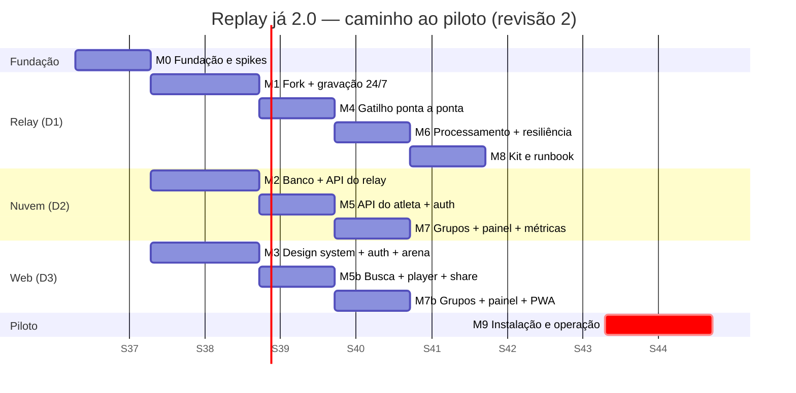
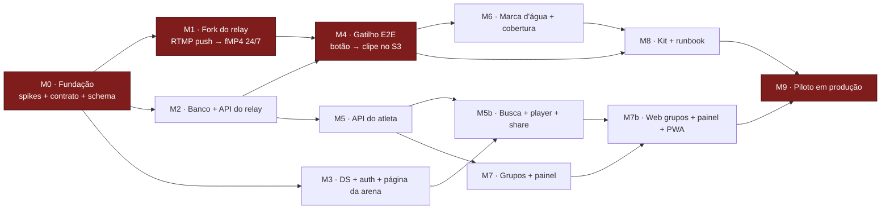

# Plano técnico — do zero ao piloto em 8 semanas

> Companheiro técnico do `PLANO.md` (backlog do PM). Define a **sequência de implementação**, os
> **marcos verificáveis**, o que **três devs fazem em paralelo** e os **riscos técnicos**.
>
> **Revisão 2 (12/09/2026)** — reescrito após a mudança de premissa: câmera → RTMP push → relay
> próprio na AWS, sem computador de borda. Base: `docs/adr/0001-stack-e-arquitetura.md`,
> `docs/modelo-de-dados.md`, `docs/api/openapi.yaml`, e o código em produção do relay v2 do
> Sentinela (`C:\Users\gabri\Documents\monitoring\relay2\`).

## Premissas

| | |
|---|---|
| Time | 3 devs full-stack fortes em TypeScript. **D1** (relay/infra), **D2** (backend/nuvem), **D3** (web). Papéis são de foco, não de exclusividade |
| Prazo | 8 semanas até a arena piloto operando em jogo real |
| Escopo do piloto | 1 arena, 2–4 quadras, ~200 clipes/dia |
| Stack | EC2 `t4g.medium`→`c7g.large` (`sa-east-1`) · Next.js 15 @ Vercel (`gru1`, **conta existente**) · Neon `aws-sa-east-1` (`pg` puro, **conta existente**) · **S3 `sa-east-1` + CloudFront** · Resend · sem Sentry |
| Repositório | Monorepo pnpm: `apps/web`, `packages/db` (SQL + `db/queries/`), `packages/shared`, `packages/api-types` + repo separado `relay/` (fork Python/shell do `relay2`) |
| Fora de escopo | App nativo, IA/highlights, telão, patrocínio, cobrança |

**A regra que sustenta tudo**: o `openapi.yaml` e as migrações do banco são escritos **antes** da implementação e mudam em PR próprio. É o que permite os três workstreams andarem em paralelo — D3 contra `prism mock`, D1 contra um servidor de contrato, D2 implementando o real.

### O que a mudança de premissa fez com o cronograma

| | Revisão 1 (borda) | Revisão 2 (relay) |
|---|---|---|
| Workstream "agente de borda" | agente TS, buffer circular, corte, fila SQLite, watchdog, imagem de disco, OTA, provisionamento por QR | **eliminado** |
| Substituído por | — | fork de um relay **que já está em produção**, removendo o que não serve |
| Gravação da sessão completa | feature a construir + problema de upload | subproduto |
| Risco de relógio na arena | crítico, 3 camadas de mitigação | **não existe** |
| Risco novo | — | **uplink da arena sem fallback local** (R1) |
| Folga estimada | zero | **~2 semanas** |

**Onde gastar as 2 semanas de folga**, em ordem: (1) medir de verdade o uplink da arena candidata **antes de assinar**; (2) endurecer a operação do relay (backup, poda, runbook, alerta); (3) o "estender lance", que virou barato e é diferencial de mercado. **Não** gastar em escopo novo de produto.

---

## 1. Mapa de marcos

**Caminho crítico**: `M0 → M1 → M4 → M9`. Continua passando pela captura, mas agora o trabalho é **adaptar código que já funciona** em vez de escrever um agente do zero — risco de execução muito menor. Quem termina cedo vai para o relay.

---

## 2. Marcos e critérios de aceite

### M0 — Fundação e spikes · **Semana 1** · todos

Uma semana sem feature, de propósito. Com a arquitetura nova, **dois spikes valem mais que todo o resto**: o uplink da arena e o comportamento real da câmera.

| Entrega | Dono | Critério de aceite |
|---|---|---|
| Monorepo + CI + ambientes; **projeto novo** no time Vercel existente (com Spend Management), **projeto novo** na conta Neon existente, AWS, Cloudflare, e o domínio `replayja.com.br` verificado na conta Resend existente | D2 | `git push` em `main` publica em `staging.replayja.com.br` em < 5 min; o gasto do projeto novo aparece separado na Vercel |
| Migrações em SQL versionado (`db/migrations/NNNN-*.sql` com `-- down`) + runner + seed com 500 clipes sintéticos | D2 | `EXPLAIN ANALYZE` da query §6.1 usa `clip_partner_time_idx`; o CI aplica `up`/`down`/`up` num branch efêmero do Neon |
| `openapi.yaml` no repo, `spectral lint` no CI, `packages/api-types`, `prism mock` | D2 | D3 consome o mock |
| **Spike U — uplink da arena candidata** ⚠️ | D1 | 48 h de medição contínua **na arena real**, com `iperf3` e ping: upload sustentado, variância, quedas por hora, e se o link é compartilhado com o Wi-Fi do bar. **Critério: upload sustentado ≥ 25 Mbps e menos de 3 quedas > 10 s por dia.** Reprovado = renegociar o link **antes de assinar o contrato**, não depois |
| **Spike C — Intelbras VIP 3230 B SL G3 na bancada** ⚠️ | D1 | Uma unidade empurrando para um relay de teste. Confirmar: (a) o push RTMP reconecta sozinho após queda; (b) **"Intervalo do frame I" e bitrate seguram** depois de 10 min — reler a configuração 2 min depois e conferir o tamanho do segmento no disco (ver R5); (c) medir `origin_lag_ms` com relógio filmado; (d) validar o **"RTMP Virtual Áudio"** (trilha silenciosa), que resolve a compatibilidade do FLV e evita capturar áudio ambiente |
| **Spike W — CPU da marca d'água no relay** | D1 | Passe completo (recorte + overlay + thumb + preview + OG) numa `c7g.large` com gravação de 4 câmeras rodando. **Critério: < 20 s por clipe, 4 clipes simultâneos sem prejudicar nenhum gravador** |
| **Spike R — entrega do clipe no Brasil** | D3 | 20 amostras de um MP4 de 12,5 MB em 4G em São Paulo, servido por CloudFront sobre S3 `sa-east-1`. **Critério: p95 de TTFB < 300 ms, primeiro quadro < 1,5 s.** Reprovado = OCI São Paulo ou Bunny SP (ADR §6.4) |
| **Spike S — Web Share API em iOS e Android** | D3 | `navigator.share({files})` com MP4 de 12,5 MB em aparelhos reais. Reprovado no iOS = definir o fallback agora, não na semana 7 |
| **Spike F — planos flat do CloudFront** ⚠️ | D2 | Confirmar no console/suporte se os planos de preço fixo (Pro US$ 15/mês, 50 TB inclusos, sem excedente) valem para o nosso caso, e se há restrição de *price class*, de conteúdo de vídeo ou de requisições. **Vale R$ 173 por arena por mês a 20 arenas** (ADR §6.3) |
| **Spike O — auth portado do Sentinela** | D2 | Copiar `app-secret.ts`, `otp.ts`, `session.ts`, `rate-limit.ts` e o `login/route.ts`, adaptar para `app_user` com `uid` no cookie, e implementar o Google por OIDC manual. **Critério: OTP em < 10 s fora do spam; entrar por OTP e depois por Google cai na mesma linha de `app_user`; `id_token` sem `email_verified` é recusado** |

> **Portão de saída**: os seis spikes escritos em `docs/decisoes.md`. **O Spike U tem poder de veto sobre a arena piloto** — é a primeira vez no projeto em que a qualidade da internet do cliente é pré-requisito contratual, e descobrir isso na semana 8 seria fatal.

---

### M1 — Fork do relay e gravação 24/7 · **Semanas 2–3** · D1

O trabalho é **subtrativo** antes de ser aditivo.

| Entrega | Critério de aceite |
|---|---|
| Fork do `relay2/` para `relay/`, removendo Tuya (`pump.py`, dialeto HLS, `AUDIO_CAMS`), `detect.py`, `enhance.py`, `sombra-noite.sh` e o transcodificador 360p | `record.sh` só conhece `rtmp_push` e `rtsp_pull`; o repositório encolhe e ninguém precisa entender a nuvem da Tuya |
| Provisionamento EC2 reproduzível: `c7g.large`, gp3 60 GB + st1 600 GB em LVM/XFS, Caddy, systemd, chrony, Elastic IP | `setup.sh` numa instância nova entrega um relay funcional; **destruir e recriar é um procedimento testado, não uma esperança** |
| Faixa RTMP 19350–19449 aberta no security group | Teste de fora em **três** portas da faixa, não só na primeira (incidente do Sentinela: só a 19350 estava aberta e as outras davam timeout silencioso de 8 s) |
| `sync-cams`/`sync-rtmp` contra `GET /relay/cameras`, com a regra "prefere errar para mais" | Derrubar o app: nenhum gravador é desligado. Resposta removendo > 50% dos gravadores: ciclo abortado e registrado |
| Gravação 24/7 em fMP4 de ~2 s + índice SQLite, com `db_release()` por requisição | **72 h** de gravação contínua de 4 câmeras; `wal_bytes` em dezenas de MB, nunca crescendo monotonicamente |
| `/clip` e `/thumb` com `auth-sidecar` HMAC, incluindo `HEAD` em todas as rotas | `HEAD /thumb` responde os cabeçalhos do `GET` **sem disparar ffmpeg** |
| `/stats` com cobertura, bitrate, segmentos longos, WAL, steal | Números batem com inspeção manual do disco |
| Poda por idade e por espaço (`DISK_HIGH` 85%), respeitando a janela de operação | Encher o disco artificialmente: a poda encurta a retenção e **nunca para de gravar** |
| Backup diário com `VACUUM INTO` (nunca `.backup`) + `timeout` | Backup em < 60 s com o serviço no ar |

**Aceite do M1**: quatro câmeras empurrando por 72 h, `coverage_24h ≥ 0,95`, `/clip` devolvendo um MP4 que toca no iPhone, e a máquina recriada do zero pelo script em < 30 min.

---

### M2 — Banco e API do relay · **Semanas 2–3** · D2

| Entrega | Critério de aceite |
|---|---|
| Migrações completas + `db/queries/` com projeção explícita, sem `rtmp_key` nem `token_hash` em nenhuma consulta de usuário | Teste que busca a câmera como `partner_admin` e confere que a resposta **não contém** `rtmpKey`; grep de CI proibindo `SELECT *` em `db/queries/` |
| `GET /relay/cameras` com versão e `304` | Alterar bitrate de uma câmera muda a `version` |
| `POST /triggers/b/{token}` e `POST /triggers` com cálculo da janela | Tabela de latências aplicada e registrada em `trigger_event`; cooldown de 8 s funciona |
| `GET /relay/clip-jobs` com claim atômico e *lease* de 120 s | Dois relays simulados nunca pegam o mesmo job; matar o "relay" no meio devolve o job em 120 s |
| `/relay/clips/{id}/upload-url` e `/confirm` com validação de checksum e `coverageRatio` | Upload truncado → `409`; `coverage 0,8` → `partial`; `coverage 0,4` → `failed` |
| `POST /relay/health` alimentando `camera_health`, `relay_health` e `coverage_gap` | Simular 5 câmeras com buraco no mesmo minuto → `likely_cause = arena_uplink` |
| `job_queue` + **Vercel Cron** + jobs: `requeue_expired_leases`, `detect_camera_down`, `purge_expired_clips`, `digest_erros` | Job com falha vai para `failed` com backoff, sem travar a fila |
| Provisionamento de câmera (porta + chave + QR) e de botão (URL de webhook) | Porta nunca reutilizada; chave e token mostrados uma única vez |

---

### M3 — Design system, auth e página da arena · **Semanas 2–3** · D3

Inalterado em relação à revisão 1 — este workstream não foi afetado pela mudança.

| Entrega | Critério de aceite |
|---|---|
| Tokens do design canvas em CSS custom properties + componentes base | Tema do parceiro trocável por variável |
| Login OTP + Google com `redirectTo` preservado | Entrar por OTP e depois por Google cai na mesma conta, num iPhone real |
| `/[arenaSlug]` com ISR, branding, abas, gate de login | Lighthouse mobile ≥ 90; `revalidateTag` atualiza em < 5 s |
| Middleware de slugs reservados + alias 308 | `/api` e `/app` nunca resolvem como arena |
| Open Graph em todas as rotas públicas | Card correto no WhatsApp real |

---

### M4 — Gatilho ponta a ponta · **Semana 4** · D1 + D2 em par

**O marco mais importante.** Trabalho em par obrigatório.

| Critério de aceite | Medida |
|---|---|
| Botão Wi-Fi na bancada → clipe visível em `staging` | **< 45 s** |
| O lance está **dentro** da janela entregue | Teste com relógio filmado: erro < 1,5 s em 20 acionamentos |
| Clipe com a marca d'água da arena de teste, tocando no iPhone | Inspeção visual; `format=yuv420p` confirmado |
| Painel mostra cobertura, bitrate e último segmento por câmera | Atualiza em < 60 s |
| **Derrubar o uplink da câmera por 60 s e apertar o botão dentro do buraco** | Clipe sai `failed` com `no_coverage`, o app explica, o painel registra um `coverage_gap` com `likely_cause = arena_uplink` |
| **Derrubar o uplink por 20 s e apertar logo depois** | Clipe sai `partial` com aviso honesto, e o vídeo toca |
| Matar o relay no meio de um corte | O job volta em 120 s e produz o mesmo clipe |
| Botão virtual do site | < 3 s entre o clique e o relay começar o corte |

Se M4 fechar na semana 4, o piloto está no prazo com folga. Se escorregar, corta-se escopo do M7 (métricas avançadas), nunca do M8.

---

### M5 / M5b — API do atleta e web · **Semana 5** · D2 e D3

| M5 (D2) | Critério |
|---|---|
| `GET /clips` com keyset, limite de 6 h, cursor assinado | p95 < 80 ms com 500k clipes |
| `GET /clips/{id}` + URL assinada de 6 h; `POST /clips/{id}/download` (15 min, `attachment`, marca `pinned`) | Nome de arquivo amigável |
| `POST /shares` + `/s/{token}` + `share_event` por canal | Abrir pelo WhatsApp registra `channel = whatsapp` |
| **`POST /clips/{id}/extend`** | Deslocar −8 s produz novo clipe em < 40 s; janela fora do disco → `409` |

| M5b (D3) | Critério |
|---|---|
| Busca com atalhos ("agora", "última hora", "ontem à noite") | Estado vazio explica o que fazer |
| Grade com scroll infinito por cursor | 60 fps num Android intermediário |
| Player + Baixar / WhatsApp / Instagram / Copiar link | Fallback do Spike S implementado |
| **Rótulo de clipe `partial`** | "Faltam ~3 s — a internet da arena oscilou". Nunca um vídeo que pula sem explicação |
| **Controles "estender lance"** (−8 s / +8 s) | Desabilitados com tooltip quando `canExtend = false` |

---

### M6 — Processamento e resiliência · **Semana 6** · D1

| Entrega | Critério de aceite |
|---|---|
| Worker de processamento em unidade systemd separada, `CPUQuota=120%`, `Nice=10`, 2 slots, `timeout` de 120 s | Com 4 clipes na fila, **nenhum gravador perde segmento** (verificado na cobertura) |
| Passe único: recorte exato + overlay + thumb + preview + OG + `faststart` | Saída bate com o comando de referência da ADR §5 |
| Cache local do PNG da marca d'água por `watermark_version` | Trocar o logo no painel: o clipe seguinte já sai com o novo |
| Reprocessamento dirigido de clipes com marca antiga (dentro das 48 h de recorte bruto) | Comando de operação documentado |
| Detecção e registro de `coverage_gap`, com agrupamento por minuto entre câmeras | Buraco simultâneo em 3 câmeras → 1 evento `arena_uplink`, não 3 eventos `camera` |
| Retenção: recorte bruto 48 h, sessão 7 dias, poda por janela de operação | Disco estável em 72 h de operação simulada |
| Alertas 1–8 da ADR §7 no ar | Cada um disparado artificialmente pelo menos uma vez |

---

### M7 / M7b — Grupos, painel e PWA · **Semanas 6–7** · D2 e D3

| M7 (D2) | Critério |
|---|---|
| CRUD de grupo, slug com sugestão em colisão, janela ≤ 6 h | Grupo que cruza a meia-noite funciona |
| `GET /groups/{id}/sessions` (query §6.2) | 8 semanas × 2 dias em < 50 ms |
| Convite por e-mail e por link, aceite com e-mail divergente | Convite expirado → `410` em pt-BR |
| API do parceiro: branding, marca d'água validada (PNG alpha, dimensões, tamanho), contatos, câmeras, botões, métricas | Trocar o logo incrementa `watermark_version` |

| M7b (D3) | Critério |
|---|---|
| Criar grupo a partir da busca; página `/[arena]/[grupo]` com cards de semana | 4 thumbnails e contagem por card |
| Convidar por e-mail e link; membros com e-mail mascarado | |
| **Painel do parceiro**: cobertura por câmera em linguagem de dono de arena ("gravou 96% de ontem"), buracos de uplink, branding com preview da marca sobre frame real, métricas | O dono entende o status sem explicação — **e entende que o buraco é da internet dele** |
| PWA instalável + acessibilidade básica | Lighthouse mobile ≥ 90; sem violação crítica no axe |

---

### M8 — Kit e runbook · **Semana 7** · D1 + D3

Muito mais simples que na revisão 1: não há imagem de disco, OTA nem pareamento de rádio.

| Entrega | Critério de aceite |
|---|---|
| Roteiro de instalação da câmera: montar, ligar, Wi-Fi/cabo, colar servidor e chave (QR), apontar, medir `origin_lag_ms` | **Uma pessoa sem contexto técnico** instala uma câmera em < 20 min |
| Roteiro do botão: ligar no Wi-Fi, colar URL de webhook, calibrar `wake_latency_ms` | < 10 min por botão |
| Checklist de rede da arena: VLAN/SSID separado para câmeras, QoS, cabo onde possível, teste de upload | Assinado pelo responsável da arena antes da instalação |
| **Runbook do relay**: crescer disco (LVM), WAL travado, steal alto, recriar a instância, mover o Elastic IP, rotacionar chaves | Testado por D2 (não pelo D1 que escreveu) numa instância de staging |
| Backup e restauração do índice testados de verdade | Restaurar num relay novo e servir `/clip` de um dia antigo |
| Guia do dono da arena em 10 passos com fotos | Testado com alguém de fora do time |

---

### M9 — Instalação e operação assistida · **Semanas 8–9** · todos

| Dia | Atividade | Critério |
|---|---|---|
| D1 | Instalação física, enquadramento, calibração de latências | Todas as câmeras `recording` no painel |
| D2 | Jogo real observado | ≥ 95% dos acionamentos viram clipe em < 60 s |
| D3–D5 | Operação assistida | Nenhum P0 aberto ao fim do dia |
| D6–D8 | Semana sem intervenção | `coverage_24h ≥ 0,95` em todas as câmeras |
| D9 | Retro com o dono e 3–5 atletas | Métricas do `PLANO.md` D5 coletadas |

**Custo-alvo do piloto** (marginal, fora o que já se paga por Vercel e Neon; USD 1 = R$ 5,10):

| Perfil | Máquina | Retenção da sessão | US$/mês | R$/mês |
|---|---|---|---|---|
| **Enxuto** (alvo do piloto) | `t4g.medium` | 3 dias (250 GB) | **72,37** | **≈ 369** |
| **Confortável** | `c7g.large` | 7 dias (600 GB) | **187,56** | **≈ 957** |
| 6 arenas (1 relay cheio) | `c7g.xlarge` | 7 dias (2,8 TB) | 606,11 | ≈ 3.094 (R$ 516/arena) |
| 20 arenas (4 relays) | 4× `c7g.xlarge` | 7 dias (9,2 TB) | 2.360,96 | ≈ 12.053 (R$ 603/arena) |

Detalhamento e a regra de quando trocar o `t4g.medium` por `c7g.large` na ADR §9.

**Critérios de sucesso técnico do piloto**:

| Métrica | Alvo |
|---|---|
| Acionamentos que viram clipe `ready` ou `partial` | ≥ 98% |
| Clipes `failed` por `no_coverage` | **≤ 1%** |
| Latência mediana botão → clipe visível | < 45 s |
| Erro de posicionamento da janela | < 1,5 s em 99% dos casos |
| `coverage_24h` por câmera | ≥ 0,95 |
| Uptime do relay | ≥ 99,5% |
| Custo de nuvem no mês (marginal, fora o que já se paga) | ≤ R$ 450 no perfil enxuto |

---

## 3. Paralelização entre 3 devs

| Sem. | D1 (relay) | D2 (nuvem) | D3 (web) | Sincronização |
|---|---|---|---|---|
| 1 | **Spike U** (uplink, na arena) + **Spike C** (câmera) + Spike W | Monorepo, contas, schema, spec, mock + Spike O | Spike R + Spike S + tokens do DS | **Portão M0 sexta.** Spike U tem veto sobre a arena |
| 2 | Fork, provisionamento EC2, gravação | API do relay, `db/queries/`, migrações | DS + login OTP/Google (portado) | Contrato congelado |
| 3 | `/clip`, `/thumb`, `/stats`, poda, backup | Gatilhos, claim de jobs, confirm, health | Página da arena + ISR + OG | **M1 · M2 · M3** |
| 4 | **M4 em par com D2** | **M4 em par com D1** | Busca + grade (contra mock) | **Portão M4 quinta** |
| 5 | Worker de processamento | API do atleta + `extend` | Player + compartilhar + rótulo `partial` | Integração quinta |
| 6 | Cobertura, gaps, alertas, retenção | Grupos + API do parceiro | Integração real + sessão compartilhável | **M5 · M5b · M6** |
| 7 | Runbook, roteiros, ensaio de instalação | Métricas, hardening, carga | Grupos + painel + PWA | **M7 · M7b · M8** · escopo congelado |
| 8 | **Instalação na arena** | Suporte em produção | UX em campo | **M9** |

### O que permite paralelizar

1. **Contrato antes do código** — `openapi.yaml` pronto no M0.
2. **`prism mock`** dá ao front uma API completa na semana 2.
3. **Simulador de relay**: um script que faz `GET /relay/clip-jobs` e confirma com um MP4 fixo. D2 testa o pipeline inteiro **sem câmera e sem relay**.
4. **Seed de 500 clipes** com thumbnails desde o M0.
5. **Feature flags por parceiro** permitem deploy em produção sem expor.

### Regras de coordenação

- **Contrato congelado ao fim da semana 2.**
- Trunk-based, branches de no máximo 2 dias, deploy contínuo em `staging`.
- Uma sincronização técnica por semana, quinta, 45 min.
- **M4 é par obrigatório.** Dividir integração ponta a ponta entre duas pessoas separadas é a forma mais rápida de perder três dias.
- **A instalação na arena é presencial, com 2 pessoas** — uma na quadra, uma no painel.
- **Ninguém mexe no relay do Sentinela.** É produção de outro produto, com clientes pagantes.

---

## 4. Riscos técnicos

### R1 — O uplink da arena virou o caminho crítico, sem fallback local

| | |
|---|---|
| **Probabilidade** | **Alta e comprovada.** O relay v2 do Sentinela mediu um buraco de **74 s** (`879.m4s` escrito 13:11:18, `880.m4s` só às 13:12:33) e **68 segmentos acima de 10 s em 24 h — todos em câmeras que empurram vídeo**. As câmeras puxadas por RTSP de dentro da LAN e as da Tuya não tiveram **nenhum** no mesmo período |
| **Impacto** | **Crítico.** Sem buffer na arena, o que não chegou ao relay não existe. Um lance dentro do buraco está perdido para sempre |
| **Detecção** | `coverage_24h`, `long_segments_24h`, `coverage_gap` com `concurrent_cameras > 1`, e a taxa de `no_coverage` por arena |
| **Mitigação** | **1. Pré-requisito contratual de banda**, verificado antes de assinar (Spike U): upload sustentado **≥ 2× a soma dos bitrates** (4 câmeras × 3 Mbps = 12 Mbps → exigir **≥ 25 Mbps**), **cabo** até cada câmera sempre que possível, **VLAN/SSID separado** do Wi-Fi dos clientes e do bar, e QoS priorizando as câmeras. Cláusula no contrato: cobertura abaixo de 0,90 por causa do link é responsabilidade da arena. **2. Bitrate por câmera** ajustável remotamente (`target_bitrate_kbps`): 3 Mbps é o alvo; 2 Mbps é o degrau de emergência, aplicável por câmera sem deploy. **3. Buracos chegam em bando** — o agrupamento por minuto entre câmeras distingue "a internet da arena caiu" de "esta câmera tem defeito", e isso muda quem precisa agir. **4. O clipe que cai num buraco é tratado com honestidade**: `partial` com aviso quando dá para entregar (`coverage ≥ 0,6`), `failed` com explicação quando não dá. Nunca um vídeo que pula sem dizer por quê. **5. Alerta de cobertura** em `< 0,90` (24 h), com o painel do parceiro mostrando o histórico — é a evidência da conversa com o dono da arena. **6. microSD na câmera** como cópia de segurança |
| **Sobre o microSD, sem ilusão** | **A pergunta do ANR já foi respondida, e a resposta é não.** `docs/hardware/pesquisa-cameras.md` §5.3 verificou modelo a modelo: *Automatic Network Replenishment* só existe no par câmera ↔ NVR do mesmo fabricante, e nenhuma câmera reenvia o trecho perdido para um destino RTMP arbitrário. Somado ao CGNAT (não conseguimos puxar o cartão remotamente), o microSD é um caminho de recuperação **manual e presencial**, útil só para um incidente de alto valor. É apólice, não mitigação — e por isso o peso da mitigação de R1 fica todo no pré-requisito de banda |
| **Plano B** | **Computador de borda naquela arena** (ADR §9). Não é contingência global: é a opção certa para arenas de uplink ruim, e o contrato de ingestão já prevê `ingest_kind = rtsp_pull` para isso. É também a razão de o plano B continuar vivo e documentado |

### R2 — O carimbo é hora de chegada, não hora da cena

| | |
|---|---|
| **Probabilidade** | Alta — é uma propriedade do desenho, não um defeito |
| **Impacto** | Alto e **silencioso**: o clipe existe, tem 25 s, e o lance está fora dele. O atleta não abre chamado, só para de usar |
| **Detecção** | Teste com relógio filmado no M4 (20 acionamentos, erro < 1,5 s) e pergunta direta na retro: "o lance estava no vídeo?" |
| **Mitigação** | **1. Duas latências medidas, não estimadas** (`camera.origin_lag_ms`, `button.wake_latency_ms`), com procedimento de instalação para cada uma. **2. Corte bruto 13 s mais largo que o entregue** — absorve erro das medidas e o alinhamento de segmento. Bytes temporários no relay custam zero. **3. Recorte exato no passe de marca d'água**, que já recodifica: precisão de quadro, não de segmento. **4. GOP curto na câmera** (1 s) mantém os segmentos em 2 s e o corte previsível. **5. "Estender lance" (−8 s / +8 s)** como rede de segurança do usuário: a sessão está em disco por 7 dias e deslocar a janela é um remux novo. **No desenho de borda isso era impossível** |
| **Plano B** | Aumentar `preRollSeconds` de 24 para 30 (custa ~25% de bytes por clipe, ~R$ 5/mês no piloto). Decisão por dados, na retro |

### R3 — O relay é ponto único de falha

| | |
|---|---|
| **Probabilidade** | Média |
| **Impacto** | **Crítico**: relay fora do ar = toda a captura de todas as arenas daquele nó parada, sem gravação nenhuma em lugar nenhum |
| **Detecção** | Uptime externo em `/stats`, ausência de `POST /relay/health` por 3 min, alerta de `camera down` em bloco |
| **Mitigação** | **1. A configuração das câmeras vive no Postgres**, não no disco do relay. Uma instância nova busca a lista e se auto-provisiona — o relay é gado, não bicho de estimação (exceto pela mídia já gravada). **2. Elastic IP**: trocar a instância move o IP, e **as câmeras reconectam sozinhas, sem ninguém ir à quadra**. **3. `setup.sh` reproduzível, testado por quem não o escreveu** (M8), com alvo de < 30 min para recriar. **4. Backup diário do índice com `VACUUM INTO`** e snapshot do volume de mídia. **5. Máquina separada da do Sentinela** — uma não derruba a outra. **6. A nuvem cair não para a gravação**: o relay grava sem o app; só o corte atrasa |
| **O que não está mitigado** | A mídia já gravada não tem réplica. Perder o volume = perder a sessão daquele período. Aceito: a sessão completa não é o produto, e os clipes já confirmados estão no S3 com 11 noves |

### R4 — CPU e disco do relay (contenção, steal, WAL, poda)

| | |
|---|---|
| **Probabilidade** | Alta se ignorada — **quatro incidentes reais do relay v2 estão nesta linha** |
| **Impacto** | Alto: um gravador estrangulado perde segmento, e segmento perdido é lance perdido |
| **Detecção** | `cpu_steal_percent`, `index_wal_bytes`, `disk_free`, `pruning_active`, `p50_encode_ms` no `POST /relay/health` |
| **Mitigação** | **1. Instância `c7g` (dedicada), não `t4g` (burstable).** O Sentinela mediu **53% de steal** numa Lightsail de 4 vCPU, sobrando ~1,9 — sem nenhum aviso. CPU dedicada aqui é requisito funcional. **2. Worker de marca d'água em cgroup próprio** (`CPUQuota=120%`, `Nice=10`, 2 slots): **gravador tem prioridade absoluta**. Melhor um clipe 40 s mais tarde que um segmento perdido. **3. `db_release()` por requisição** — sem isso um cursor aberto trava o checkpoint do SQLite e o WAL vai a 7,1 GB contra um banco de 703 MB, 19 h sem checkpoint, **zero erros visíveis**. Alerta em 512 MB. **4. Backup com `VACUUM INTO`, nunca `.backup`** — o `.backup` reinicia a cada commit de escritor externo e **nunca termina** com WAL grande: 7h28min queimando um vCPU para entregar 4 KB. Com `timeout` no script. **5. Poda por idade e por espaço**, encurtando a retenção antes de deixar de gravar. **6. LVM** — crescer o disco sem parar nada (`pvcreate`/`vgextend`/`lvextend -r`), como feito em produção em 11/09 |
| **Plano B** | `c7g.xlarge` (dobra o custo da instância, +US$ 54/mês) ou worker de processamento em instância própria. Ambos sem mudança de contrato |

### R5 — A câmera não obedece à configuração (e mente sobre isso)

| | |
|---|---|
| **Probabilidade** | Média — **documentada em produção** |
| **Impacto** | Alto e caro: uma câmera que ignora o limite de bitrate multiplica disco e uplink. No Sentinela, **uma câmera de 19 consumiu 36% do disco da frota inteira** (28,7 MB/min, 40 GB/dia, 234 GB) |
| **Detecção** | `observed_bitrate_kbps` contra `target_bitrate_kbps` no `POST /relay/health`; alerta em desvio > 30% por mais de 1 h. **Medir o tamanho do segmento no disco, não acreditar na resposta da câmera** |
| **Mitigação** | **1. Nunca confiar no "OK" da câmera.** O Sentinela documentou uma Hikvision em que o `PUT` da ISAPI respondia `statusString OK`, o `GET` de releitura confirmava os valores novos, os segmentos mudavam na hora — e **~70 s depois a câmera revertia tudo sozinha**. Regra: **reler a configuração 2 minutos depois, e conferir o bitrate real no disco**. **2. Spike C na semana 1**, com essa verificação explícita, **antes de comprar o lote**. **3. Alerta automático de desvio de bitrate**, porque isso reaparece depois de reset de fábrica, troca de firmware ou queda de energia. **4. Homologar um modelo só** para o piloto, com firmware fixado. **5. A poda por espaço é a última linha**: uma câmera desobediente encurta a retenção de todas, mas nenhuma para de gravar |
| **Plano B** | Trocar o modelo; ou, se o stream principal não obedecer, gravar o **sub-stream** — foi o que o Sentinela fez, caindo de 28,7 para 2,09 MB/min (93% a menos), ao custo de resolução. Para nós esse custo é alto, porque a mesma stream vira o clipe |

### Riscos secundários monitorados

| Risco | Impacto | Mitigação |
|---|---|---|
| **Chave RTMP vazada** (texto claro, sem autenticação) | Médio: alguém empurra vídeo para a nossa gravação de uma quadra | Chave longa e aleatória; porta dedicada por câmera; `rtmp_key` sem policy de leitura nem para admin da arena; rotação em um clique (com aviso de que a câmera para até alguém redigitar); alerta quando o bitrate ou a resolução de uma câmera muda sem ninguém ter mexido |
| **Web Share API não entrega MP4 no iOS** | Alto para o compartilhamento | Spike S na semana 1; fallback de download + instrução visual. Nunca depender só do `navigator.share` |
| **OTP caindo em spam** | Alto (mata a conversão de login) | SPF+DKIM+DMARC no M0; **domínio `replayja.com.br` próprio, não o do Sentinela** — um OTP do Replay já chegando de `@sentinelacam.com` parece phishing; teste em Gmail, Outlook e Yahoo; Google sempre visível como alternativa |
| **Latência de entrega do clipe** | Alto se acontecer | Spike R na semana 1; `faststart` obrigatório; thumbnails públicos e imutáveis; OCI São Paulo e Bunny SP dimensionados como plano B na ADR §6.4 |
| **Conta maior que o previsto** | Médio | Budget alert na AWS em 120%; **Spend Management na Vercel** (o uso do Replay já cai na fatura do Sentinela); alarme de `CPUCreditBalance` no `t4g.medium` com modo de crédito em `standard`, não `unlimited`; e a conferência da fatura do Sentinela quanto a excedente de transferência do Lightsail (ADR §3) |
| **LGPD: imagem de terceiros** | Médio-alto | Login obrigatório; nada indexável; URLs assinadas curtas; takedown em 72 h **no S3, no cache do CloudFront e no relay**; sinalização física obrigatória na quadra como cláusula contratual. **Vídeo, banco e gravação ficam os três em São Paulo** — o que reduz, mas não elimina, a análise de transferência internacional (ADR §6.1) |
| **Só o D1 conhece o relay** | Médio | D2 em par durante todo o M4; **o runbook é testado por D2**, não por D1; o fork é versionado e o `setup.sh` é a única forma de provisionar |
| **Sem RLS, a autorização tem um dono só** | Alto se falhar | `db/queries/` como único lugar com SQL (grep de CI), sessão como primeiro argumento obrigatório, escopo no `WHERE`, e **teste de 403 por rota** na definição de pronto. Ver `modelo-de-dados.md` §7 |
| **Sem Sentry, erro intermitente demora mais para ser visto** | Médio | `app_error` no Neon com `fingerprint` e contador, resumo diário por e-mail com as 10 mais frequentes e qualquer uma nova; alerta imediato só para as oito condições da ADR §7 |
| **Slug colidindo com rota futura** | Médio | `reserved_slug` no banco + lista no código + teste de CI; slug imutável com alias 308 |

---

## 5. Definição de pronto

1. Teste automatizado do caminho feliz **e** de pelo menos um modo de falha.
2. Exercitado manualmente num **celular real** (não simulador).
3. `openapi.yaml` reflete o implementado (teste de contrato no CI).
4. Erros novos caem em `app_error` (`fingerprint` + `traceId`) e a mensagem ao usuário está em pt-BR.
5. Mudança de schema: migração roda para frente e para trás em ambiente limpo.
6. **Se toca o relay: testado com o uplink da câmera caindo no meio**, e o runbook atualizado.

---

## 6. O que deliberadamente fica de fora do piloto

| Item | Por quê | Quando |
|---|---|---|
| Highlights automáticos / IA | A sessão completa é gravada **só para acumular matéria-prima**. Sem dados reais, qualquer modelo é chute | Fase 3 |
| Live / telão na arena | O relay já tem playlist ao vivo — mas ativar isso muda o perfil de banda e de CPU, e não é o que fecha o contrato | Fase 3 |
| Arquivamento da sessão em armazenamento de objetos | US$ 79/mês de armazenamento a mais, sem nenhum leitor hoje (ADR §6.5) | Quando a IA definir o que vale guardar |
| Ingest único (MediaMTX) | Só compensa acima de ~24 câmeras por relay | 6ª arena |
| Segundo relay / alta disponibilidade | 1 arena não justifica; a recuperação é recriar em < 30 min | 6ª arena |
| Patrocínio nos vídeos | O passe de marca d'água já suporta um segundo PNG; a regra de negócio não existe | Fase 3 |
| App nativo | Web-first é decisão de produto | Só se o Spike S mostrar limitação real |
| Cobrança no produto | B2B com contrato e PIX fora do sistema | Depois do 3º cliente |
